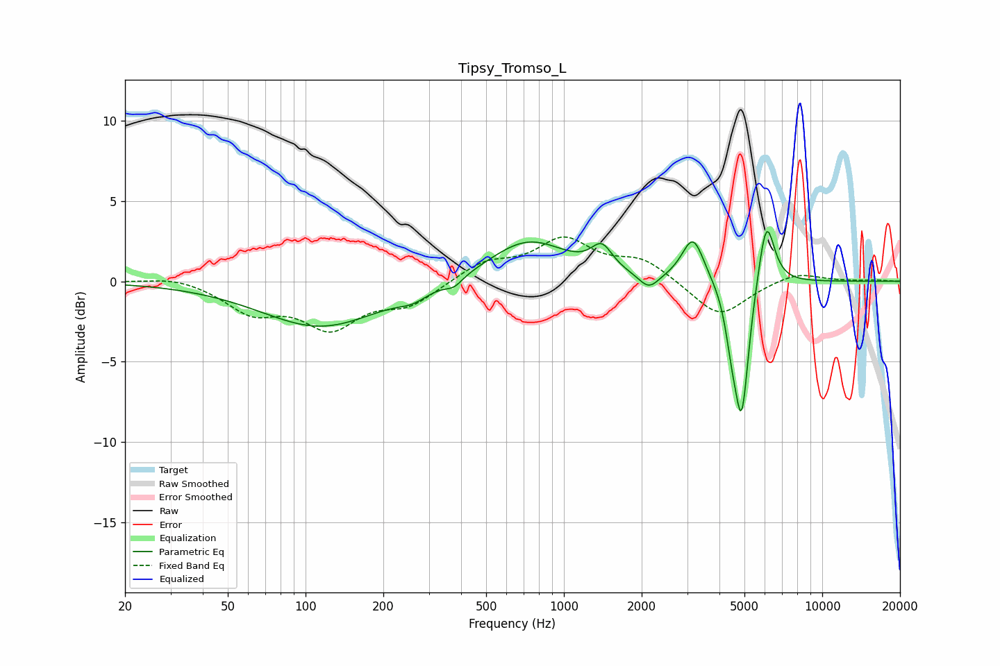

# Tipsy_Tromso_L
See [usage instructions](https://github.com/jaakkopasanen/AutoEq#usage) for more options and info.

### Parametric EQs
Apply preamp of -3.2 dB when using parametric equalizer.

|   # | Type    |   Fc (Hz) |    Q |   Gain (dB) |
|-----|---------|-----------|------|-------------|
|   1 | Peaking |       115 | 0.61 |        -2.8 |
|   2 | Peaking |       261 | 2.42 |        -0.5 |
|   3 | Peaking |       376 | 4.2  |        -0.5 |
|   4 | Peaking |       725 | 0.93 |         2.6 |
|   5 | Peaking |      1403 | 3.49 |         1.5 |
|   6 | Peaking |      2132 | 3.6  |        -1   |
|   7 | Peaking |      3161 | 3.34 |         2.8 |
|   8 | Peaking |      4452 | 5.98 |        -2   |
|   9 | Peaking |      4876 | 4.98 |        -8.3 |
|  10 | Peaking |      6075 | 4.4  |         4.3 |

### Fixed Band EQs
When using fixed band (also called graphic) equalizer, apply preamp of **-2.9 dB** (if available) and set gains manually with these parameters.

|   # | Type    |   Fc (Hz) |    Q |   Gain (dB) |
|-----|---------|-----------|------|-------------|
|   1 | Peaking |        31 | 1.41 |         0.4 |
|   2 | Peaking |        62 | 1.41 |        -1.8 |
|   3 | Peaking |       125 | 1.41 |        -2.7 |
|   4 | Peaking |       250 | 1.41 |        -1.3 |
|   5 | Peaking |       500 | 1.41 |         1.1 |
|   6 | Peaking |      1000 | 1.41 |         2.5 |
|   7 | Peaking |      2000 | 1.41 |         1.3 |
|   8 | Peaking |      4000 | 1.41 |        -2.3 |
|   9 | Peaking |      8000 | 1.41 |         0.6 |
|  10 | Peaking |     16000 | 1.41 |         0.1 |

### Graphs

