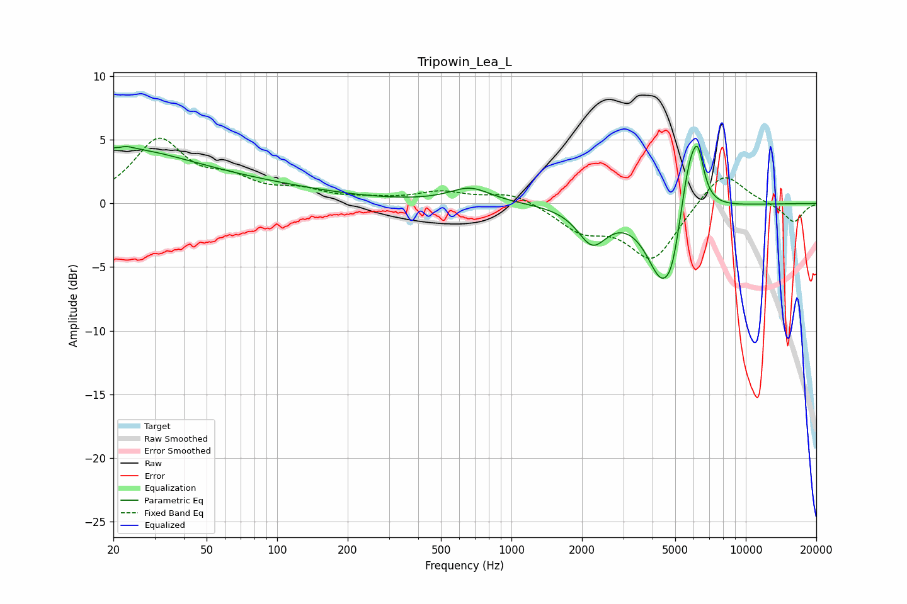

# Tripowin_Lea_L
See [usage instructions](https://github.com/jaakkopasanen/AutoEq#usage) for more options and info.

### Parametric EQs
Apply preamp of -4.6 dB when using parametric equalizer.

|   # | Type    |   Fc (Hz) |    Q |   Gain (dB) |
|-----|---------|-----------|------|-------------|
|   1 | Peaking |        20 | 0.45 |         3.9 |
|   2 | Peaking |        22 | 6    |        -2.9 |
|   3 | Peaking |        22 | 5.7  |         3.1 |
|   4 | Peaking |        77 | 0.41 |         1.1 |
|   5 | Peaking |       667 | 1.6  |         1.2 |
|   6 | Peaking |      2215 | 2.27 |        -2.8 |
|   7 | Peaking |      4407 | 2.04 |        -6   |
|   8 | Peaking |      4878 | 4.3  |        -1.8 |
|   9 | Peaking |      5772 | 3.25 |         5.1 |
|  10 | Peaking |      6265 | 5.77 |         2.7 |

### Fixed Band EQs
When using fixed band (also called graphic) equalizer, apply preamp of **-5.2 dB** (if available) and set gains manually with these parameters.

|   # | Type    |   Fc (Hz) |    Q |   Gain (dB) |
|-----|---------|-----------|------|-------------|
|   1 | Peaking |        31 | 1.41 |         4.8 |
|   2 | Peaking |        62 | 1.41 |         1.5 |
|   3 | Peaking |       125 | 1.41 |         0.8 |
|   4 | Peaking |       250 | 1.41 |         0.2 |
|   5 | Peaking |       500 | 1.41 |         0.8 |
|   6 | Peaking |      1000 | 1.41 |         0.9 |
|   7 | Peaking |      2000 | 1.41 |        -1.9 |
|   8 | Peaking |      4000 | 1.41 |        -4.4 |
|   9 | Peaking |      8000 | 1.41 |         2.8 |
|  10 | Peaking |     16000 | 1.41 |        -1.5 |

### Graphs

