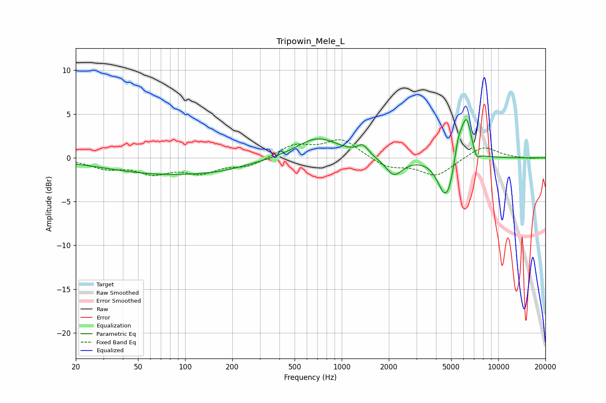

# Tripowin_Mele_L
See [usage instructions](https://github.com/jaakkopasanen/AutoEq#usage) for more options and info.

### Parametric EQs
Apply preamp of -4.5 dB when using parametric equalizer.

|   # | Type    |   Fc (Hz) |    Q |   Gain (dB) |
|-----|---------|-----------|------|-------------|
|   1 | Peaking |        80 | 0.34 |        -1.9 |
|   2 | Peaking |       170 | 0.93 |        -0.2 |
|   3 | Peaking |       702 | 1.04 |         2.4 |
|   4 | Peaking |      1365 | 4.09 |         1.1 |
|   5 | Peaking |      2158 | 2.61 |        -2.1 |
|   6 | Peaking |      4565 | 2.86 |        -4.1 |
|   7 | Peaking |      4921 | 4.59 |        -1.1 |
|   8 | Peaking |      5545 | 5.79 |         2   |
|   9 | Peaking |      6254 | 3.83 |         5   |
|  10 | Peaking |      7224 | 5.74 |        -1.2 |

### Fixed Band EQs
When using fixed band (also called graphic) equalizer, apply preamp of **-2.2 dB** (if available) and set gains manually with these parameters.

|   # | Type    |   Fc (Hz) |    Q |   Gain (dB) |
|-----|---------|-----------|------|-------------|
|   1 | Peaking |        31 | 1.41 |        -1.1 |
|   2 | Peaking |        62 | 1.41 |        -1.5 |
|   3 | Peaking |       125 | 1.41 |        -1.5 |
|   4 | Peaking |       250 | 1.41 |        -0.9 |
|   5 | Peaking |       500 | 1.41 |         1.4 |
|   6 | Peaking |      1000 | 1.41 |         2.1 |
|   7 | Peaking |      2000 | 1.41 |        -1.1 |
|   8 | Peaking |      4000 | 1.41 |        -2   |
|   9 | Peaking |      8000 | 1.41 |         1.4 |
|  10 | Peaking |     16000 | 1.41 |        -0.1 |

### Graphs

