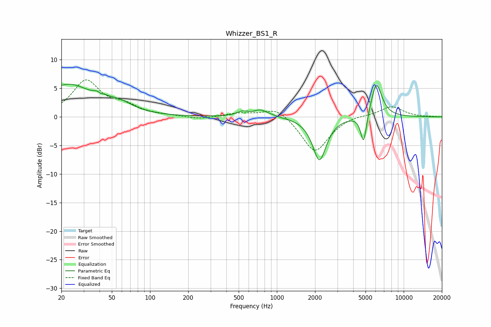

# Whizzer_BS1_R
See [usage instructions](https://github.com/jaakkopasanen/AutoEq#usage) for more options and info.

### Parametric EQs
Apply preamp of -5.8 dB when using parametric equalizer.

|   # | Type    |   Fc (Hz) |    Q |   Gain (dB) |
|-----|---------|-----------|------|-------------|
|   1 | Peaking |        22 | 0.74 |         5.5 |
|   2 | Peaking |        40 | 5.08 |         3.3 |
|   3 | Peaking |        40 | 6    |        -2.9 |
|   4 | Peaking |        57 | 1.35 |         1.5 |
|   5 | Peaking |       536 | 3.05 |         0.8 |
|   6 | Peaking |       726 | 3.49 |         0.5 |
|   7 | Peaking |       787 | 2.09 |         0.7 |
|   8 | Peaking |      2167 | 2.63 |        -7.6 |
|   9 | Peaking |      4833 | 5.85 |        -5.4 |
|  10 | Peaking |      6083 | 3.14 |         6.2 |

### Fixed Band EQs
When using fixed band (also called graphic) equalizer, apply preamp of **-6.6 dB** (if available) and set gains manually with these parameters.

|   # | Type    |   Fc (Hz) |    Q |   Gain (dB) |
|-----|---------|-----------|------|-------------|
|   1 | Peaking |        31 | 1.41 |         6.2 |
|   2 | Peaking |        62 | 1.41 |         1.6 |
|   3 | Peaking |       125 | 1.41 |         0.2 |
|   4 | Peaking |       250 | 1.41 |        -0.5 |
|   5 | Peaking |       500 | 1.41 |         0.6 |
|   6 | Peaking |      1000 | 1.41 |         1.9 |
|   7 | Peaking |      2000 | 1.41 |        -6.3 |
|   8 | Peaking |      4000 | 1.41 |         0.4 |
|   9 | Peaking |      8000 | 1.41 |         1.9 |
|  10 | Peaking |     16000 | 1.41 |         0   |

### Graphs

