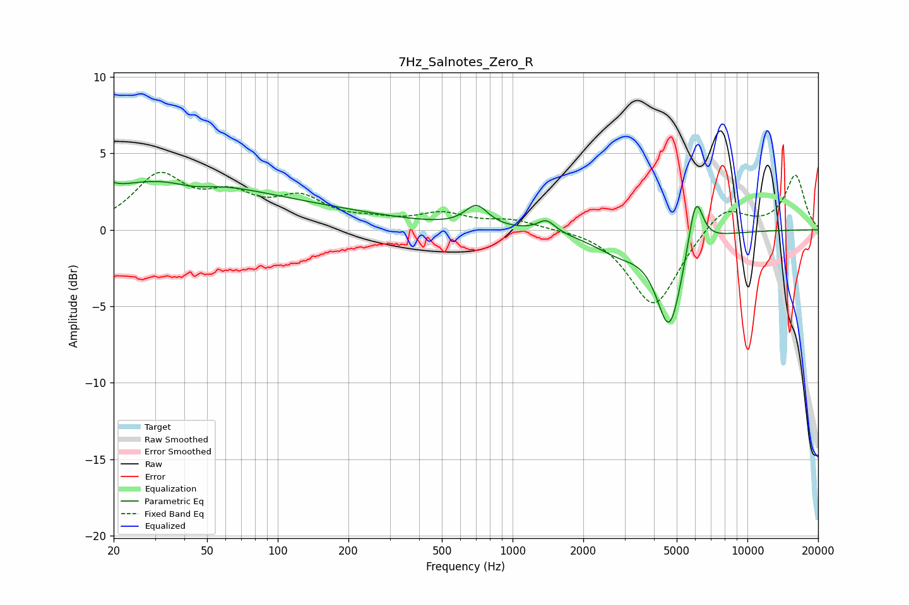

# 7Hz_Salnotes_Zero_R
See [usage instructions](https://github.com/jaakkopasanen/AutoEq#usage) for more options and info.

### Parametric EQs
Apply preamp of -3.3 dB when using parametric equalizer.

|   # | Type    |   Fc (Hz) |    Q |   Gain (dB) |
|-----|---------|-----------|------|-------------|
|   1 | Peaking |        20 | 5.95 |         3.1 |
|   2 | Peaking |        20 | 6    |        -2.8 |
|   3 | Peaking |        30 | 0.41 |         2.9 |
|   4 | Peaking |        44 | 1.71 |        -0.5 |
|   5 | Peaking |       121 | 0.36 |         1.1 |
|   6 | Peaking |       702 | 2.95 |         1.4 |
|   7 | Peaking |      1393 | 3.83 |         0.8 |
|   8 | Peaking |      2841 | 1.24 |        -1.2 |
|   9 | Peaking |      4653 | 2.55 |        -6.1 |
|  10 | Peaking |      6021 | 4.39 |         3.6 |

### Fixed Band EQs
When using fixed band (also called graphic) equalizer, apply preamp of **-3.9 dB** (if available) and set gains manually with these parameters.

|   # | Type    |   Fc (Hz) |    Q |   Gain (dB) |
|-----|---------|-----------|------|-------------|
|   1 | Peaking |        31 | 1.41 |         3.3 |
|   2 | Peaking |        62 | 1.41 |         1.8 |
|   3 | Peaking |       125 | 1.41 |         1.8 |
|   4 | Peaking |       250 | 1.41 |         0.4 |
|   5 | Peaking |       500 | 1.41 |         0.9 |
|   6 | Peaking |      1000 | 1.41 |         0.6 |
|   7 | Peaking |      2000 | 1.41 |         0.1 |
|   8 | Peaking |      4000 | 1.41 |        -5.1 |
|   9 | Peaking |      8000 | 1.41 |         1.7 |
|  10 | Peaking |     16000 | 1.41 |         3.6 |

### Graphs

