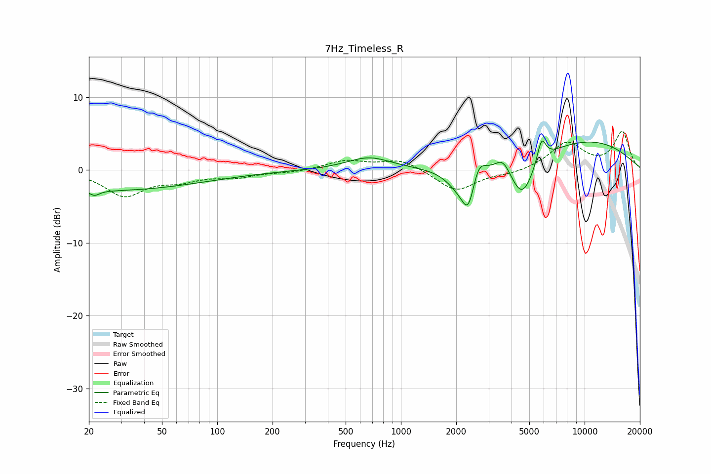

# 7Hz_Timeless_R
See [usage instructions](https://github.com/jaakkopasanen/AutoEq#usage) for more options and info.

### Parametric EQs
Apply preamp of -4.1 dB when using parametric equalizer.

|   # | Type    |   Fc (Hz) |    Q |   Gain (dB) |
|-----|---------|-----------|------|-------------|
|   1 | Peaking |        22 | 5.73 |        -0.7 |
|   2 | Peaking |        23 | 0.24 |        -2.8 |
|   3 | Peaking |       669 | 1.17 |         1.7 |
|   4 | Peaking |      2034 | 2.06 |        -2   |
|   5 | Peaking |      2331 | 3.78 |        -5.2 |
|   6 | Peaking |      2632 | 3.76 |         2.8 |
|   7 | Peaking |      3593 | 3.49 |         1.9 |
|   8 | Peaking |      4573 | 2.14 |        -5.6 |
|   9 | Peaking |      5829 | 5.9  |         3.3 |
|  10 | Peaking |     10000 | 0.39 |         4   |

### Fixed Band EQs
When using fixed band (also called graphic) equalizer, apply preamp of **-5.4 dB** (if available) and set gains manually with these parameters.

|   # | Type    |   Fc (Hz) |    Q |   Gain (dB) |
|-----|---------|-----------|------|-------------|
|   1 | Peaking |        31 | 1.41 |        -3.4 |
|   2 | Peaking |        62 | 1.41 |        -1.2 |
|   3 | Peaking |       125 | 1.41 |        -0.9 |
|   4 | Peaking |       250 | 1.41 |        -0.3 |
|   5 | Peaking |       500 | 1.41 |         1.2 |
|   6 | Peaking |      1000 | 1.41 |         1.5 |
|   7 | Peaking |      2000 | 1.41 |        -3   |
|   8 | Peaking |      4000 | 1.41 |        -0.5 |
|   9 | Peaking |      8000 | 1.41 |         3.7 |
|  10 | Peaking |     16000 | 1.41 |         5.1 |

### Graphs

