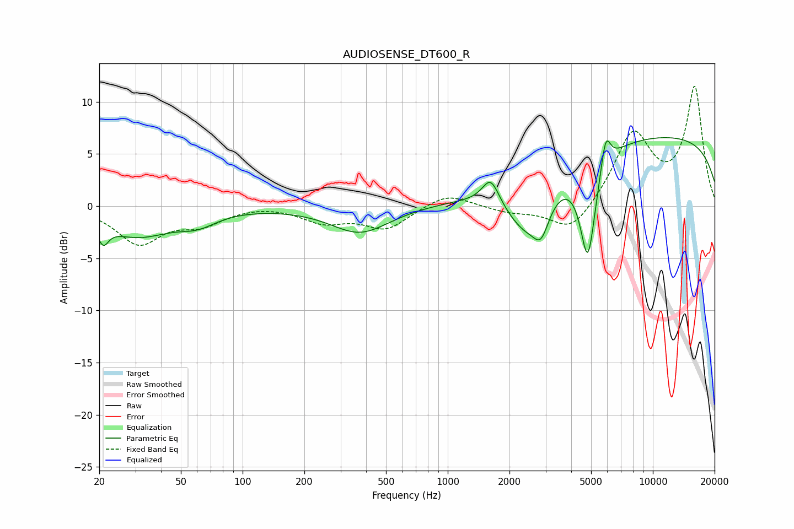

# AUDIOSENSE_DT600_R
See [usage instructions](https://github.com/jaakkopasanen/AutoEq#usage) for more options and info.

### Parametric EQs
Apply preamp of -6.7 dB when using parametric equalizer.

|   # | Type    |   Fc (Hz) |    Q |   Gain (dB) |
|-----|---------|-----------|------|-------------|
|   1 | Peaking |        21 | 5.58 |        -1.8 |
|   2 | Peaking |        31 | 0.84 |        -2.7 |
|   3 | Peaking |        60 | 1.54 |        -1.1 |
|   4 | Peaking |       374 | 0.99 |        -2.6 |
|   5 | Peaking |      1620 | 3.47 |         2.5 |
|   6 | Peaking |      2423 | 1.31 |        -5.2 |
|   7 | Peaking |      2855 | 3.68 |        -2.7 |
|   8 | Peaking |      4821 | 3.63 |        -9.6 |
|   9 | Peaking |      5892 | 5.98 |         3.2 |
|  10 | Peaking |     10000 | 0.18 |         6.8 |

### Fixed Band EQs
When using fixed band (also called graphic) equalizer, apply preamp of **-11.6 dB** (if available) and set gains manually with these parameters.

|   # | Type    |   Fc (Hz) |    Q |   Gain (dB) |
|-----|---------|-----------|------|-------------|
|   1 | Peaking |        31 | 1.41 |        -3.5 |
|   2 | Peaking |        62 | 1.41 |        -1.5 |
|   3 | Peaking |       125 | 1.41 |         0.2 |
|   4 | Peaking |       250 | 1.41 |        -1.4 |
|   5 | Peaking |       500 | 1.41 |        -2.1 |
|   6 | Peaking |      1000 | 1.41 |         1.3 |
|   7 | Peaking |      2000 | 1.41 |        -0.6 |
|   8 | Peaking |      4000 | 1.41 |        -2.7 |
|   9 | Peaking |      8000 | 1.41 |         6.9 |
|  10 | Peaking |     16000 | 1.41 |        11.2 |

### Graphs

