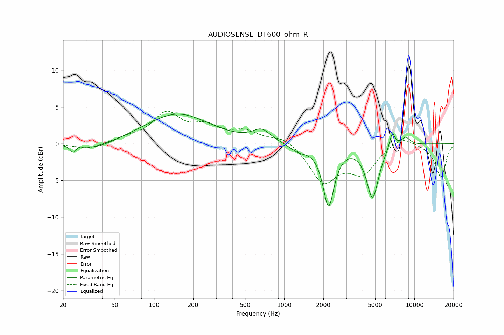

# AUDIOSENSE_DT600_ohm_R
See [usage instructions](https://github.com/jaakkopasanen/AutoEq#usage) for more options and info.

### Parametric EQs
Apply preamp of -4.1 dB when using parametric equalizer.

|   # | Type    |   Fc (Hz) |    Q |   Gain (dB) |
|-----|---------|-----------|------|-------------|
|   1 | Peaking |        24 | 5.98 |        -1.4 |
|   2 | Peaking |        25 | 3.81 |         0.6 |
|   3 | Peaking |        35 | 1.03 |        -1   |
|   4 | Peaking |       151 | 0.58 |         4.1 |
|   5 | Peaking |       672 | 2.12 |         1.6 |
|   6 | Peaking |      1283 | 2.19 |        -0.9 |
|   7 | Peaking |      2192 | 3.31 |        -8.2 |
|   8 | Peaking |      4775 | 3.03 |        -7.2 |
|   9 | Peaking |      6758 | 6    |         2.3 |
|  10 | Peaking |      8558 | 3.68 |         1.1 |

### Fixed Band EQs
When using fixed band (also called graphic) equalizer, apply preamp of **-4.5 dB** (if available) and set gains manually with these parameters.

|   # | Type    |   Fc (Hz) |    Q |   Gain (dB) |
|-----|---------|-----------|------|-------------|
|   1 | Peaking |        31 | 1.41 |        -0.8 |
|   2 | Peaking |        62 | 1.41 |         0.6 |
|   3 | Peaking |       125 | 1.41 |         3.9 |
|   4 | Peaking |       250 | 1.41 |         2   |
|   5 | Peaking |       500 | 1.41 |         1.5 |
|   6 | Peaking |      1000 | 1.41 |         1.1 |
|   7 | Peaking |      2000 | 1.41 |        -5.1 |
|   8 | Peaking |      4000 | 1.41 |        -3.7 |
|   9 | Peaking |      8000 | 1.41 |         1.3 |
|  10 | Peaking |     16000 | 1.41 |        -4.6 |

### Graphs

