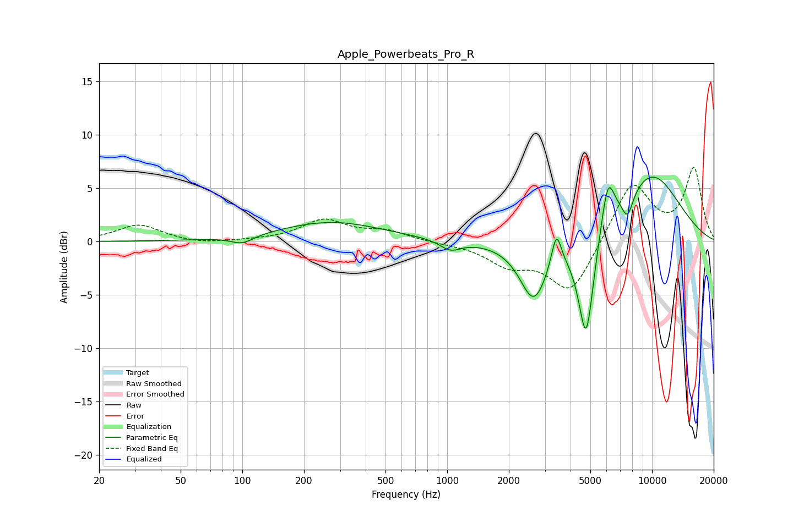

# Apple_Powerbeats_Pro_R
See [usage instructions](https://github.com/jaakkopasanen/AutoEq#usage) for more options and info.

### Parametric EQs
Apply preamp of -6.1 dB when using parametric equalizer.

|   # | Type    |   Fc (Hz) |    Q |   Gain (dB) |
|-----|---------|-----------|------|-------------|
|   1 | Peaking |       100 | 2.55 |        -0.8 |
|   2 | Peaking |       272 | 0.56 |         1.8 |
|   3 | Peaking |      1038 | 2.77 |        -0.9 |
|   4 | Peaking |      2647 | 2.68 |        -0.5 |
|   5 | Peaking |      2648 | 2    |        -5.1 |
|   6 | Peaking |      3415 | 5.99 |         3.2 |
|   7 | Peaking |      4768 | 3.57 |       -10.3 |
|   8 | Peaking |      6086 | 4.22 |         4.5 |
|   9 | Peaking |      7598 | 4.79 |        -2.2 |
|  10 | Peaking |      9865 | 0.76 |         6.4 |

### Fixed Band EQs
When using fixed band (also called graphic) equalizer, apply preamp of **-7.0 dB** (if available) and set gains manually with these parameters.

|   # | Type    |   Fc (Hz) |    Q |   Gain (dB) |
|-----|---------|-----------|------|-------------|
|   1 | Peaking |        31 | 1.41 |         1.6 |
|   2 | Peaking |        62 | 1.41 |        -0.3 |
|   3 | Peaking |       125 | 1.41 |         0.1 |
|   4 | Peaking |       250 | 1.41 |         2   |
|   5 | Peaking |       500 | 1.41 |         0.9 |
|   6 | Peaking |      1000 | 1.41 |        -0.1 |
|   7 | Peaking |      2000 | 1.41 |        -2   |
|   8 | Peaking |      4000 | 1.41 |        -4.9 |
|   9 | Peaking |      8000 | 1.41 |         5.7 |
|  10 | Peaking |     16000 | 1.41 |         6.7 |

### Graphs

