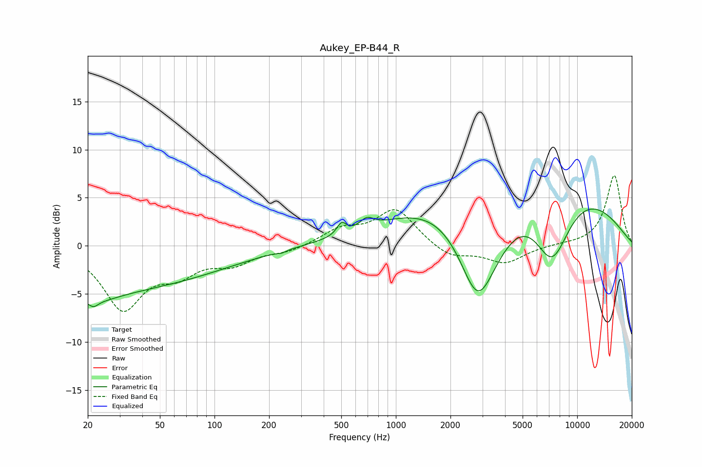

# Aukey_EP-B44_R
See [usage instructions](https://github.com/jaakkopasanen/AutoEq#usage) for more options and info.

### Parametric EQs
Apply preamp of -3.9 dB when using parametric equalizer.

|   # | Type    |   Fc (Hz) |    Q |   Gain (dB) |
|-----|---------|-----------|------|-------------|
|   1 | Peaking |        21 | 1.01 |        -1.3 |
|   2 | Peaking |        22 | 5.91 |        -0.6 |
|   3 | Peaking |        22 | 0.19 |        -4.5 |
|   4 | Peaking |       234 | 6    |        -0.2 |
|   5 | Peaking |       502 | 5.58 |         1.2 |
|   6 | Peaking |       692 | 3.81 |         1   |
|   7 | Peaking |      2827 | 1.29 |        -9.8 |
|   8 | Peaking |      3665 | 0.67 |        -6.4 |
|   9 | Peaking |      4591 | 0.3  |        13.4 |
|  10 | Peaking |      7246 | 1.2  |        -8.9 |

### Fixed Band EQs
When using fixed band (also called graphic) equalizer, apply preamp of **-7.4 dB** (if available) and set gains manually with these parameters.

|   # | Type    |   Fc (Hz) |    Q |   Gain (dB) |
|-----|---------|-----------|------|-------------|
|   1 | Peaking |        31 | 1.41 |        -6.3 |
|   2 | Peaking |        62 | 1.41 |        -2.3 |
|   3 | Peaking |       125 | 1.41 |        -1.6 |
|   4 | Peaking |       250 | 1.41 |        -0.6 |
|   5 | Peaking |       500 | 1.41 |         1.6 |
|   6 | Peaking |      1000 | 1.41 |         3.8 |
|   7 | Peaking |      2000 | 1.41 |        -1.3 |
|   8 | Peaking |      4000 | 1.41 |        -1.8 |
|   9 | Peaking |      8000 | 1.41 |         0.1 |
|  10 | Peaking |     16000 | 1.41 |         7.4 |

### Graphs

