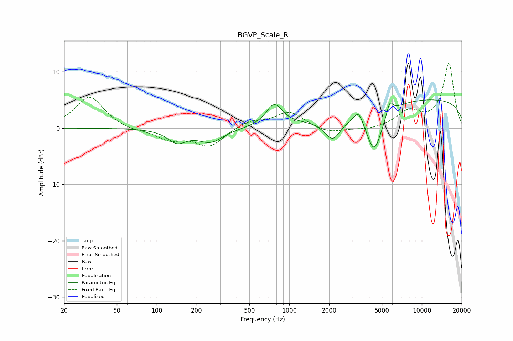

# BGVP_Scale_R
See [usage instructions](https://github.com/jaakkopasanen/AutoEq#usage) for more options and info.

### Parametric EQs
Apply preamp of -5.1 dB when using parametric equalizer.

|   # | Type    |   Fc (Hz) |    Q |   Gain (dB) |
|-----|---------|-----------|------|-------------|
|   1 | Peaking |       142 | 2    |        -2.3 |
|   2 | Peaking |       255 | 1.5  |        -2.4 |
|   3 | Peaking |       770 | 2.3  |         3.9 |
|   4 | Peaking |      2124 | 2.08 |        -3.6 |
|   5 | Peaking |      2144 | 3.11 |        -0.5 |
|   6 | Peaking |      3320 | 4.23 |         0.3 |
|   7 | Peaking |      3341 | 4.32 |         1.9 |
|   8 | Peaking |      4371 | 2.3  |        -8   |
|   9 | Peaking |      5734 | 5.93 |         2.4 |
|  10 | Peaking |     10000 | 0.18 |         5.2 |

### Fixed Band EQs
When using fixed band (also called graphic) equalizer, apply preamp of **-11.7 dB** (if available) and set gains manually with these parameters.

|   # | Type    |   Fc (Hz) |    Q |   Gain (dB) |
|-----|---------|-----------|------|-------------|
|   1 | Peaking |        31 | 1.41 |         5.6 |
|   2 | Peaking |        62 | 1.41 |        -0.5 |
|   3 | Peaking |       125 | 1.41 |        -1.9 |
|   4 | Peaking |       250 | 1.41 |        -3.2 |
|   5 | Peaking |       500 | 1.41 |         1.3 |
|   6 | Peaking |      1000 | 1.41 |         2.8 |
|   7 | Peaking |      2000 | 1.41 |        -1   |
|   8 | Peaking |      4000 | 1.41 |        -0.4 |
|   9 | Peaking |      8000 | 1.41 |         2.7 |
|  10 | Peaking |     16000 | 1.41 |        11.6 |

### Graphs

