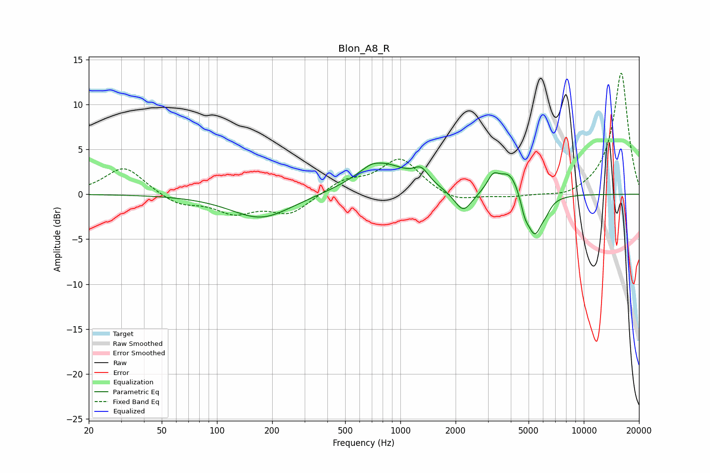

# Blon_A8_R
See [usage instructions](https://github.com/jaakkopasanen/AutoEq#usage) for more options and info.

### Parametric EQs
Apply preamp of -3.6 dB when using parametric equalizer.

|   # | Type    |   Fc (Hz) |    Q |   Gain (dB) |
|-----|---------|-----------|------|-------------|
|   1 | Peaking |       174 | 0.86 |        -2.7 |
|   2 | Peaking |       691 | 3.36 |         0.3 |
|   3 | Peaking |       793 | 0.96 |         3.4 |
|   4 | Peaking |      1299 | 3.49 |         1.5 |
|   5 | Peaking |      2203 | 2.89 |        -2.5 |
|   6 | Peaking |      3202 | 4.58 |         1.5 |
|   7 | Peaking |      3959 | 2.33 |         2.8 |
|   8 | Peaking |      4765 | 5.98 |        -1.6 |
|   9 | Peaking |      5400 | 3.22 |        -4.7 |
|  10 | Peaking |      6239 | 5.68 |        -0.6 |

### Fixed Band EQs
When using fixed band (also called graphic) equalizer, apply preamp of **-13.6 dB** (if available) and set gains manually with these parameters.

|   # | Type    |   Fc (Hz) |    Q |   Gain (dB) |
|-----|---------|-----------|------|-------------|
|   1 | Peaking |        31 | 1.41 |         3.1 |
|   2 | Peaking |        62 | 1.41 |        -1.2 |
|   3 | Peaking |       125 | 1.41 |        -1.9 |
|   4 | Peaking |       250 | 1.41 |        -2.1 |
|   5 | Peaking |       500 | 1.41 |         1.4 |
|   6 | Peaking |      1000 | 1.41 |         3.9 |
|   7 | Peaking |      2000 | 1.41 |        -1   |
|   8 | Peaking |      4000 | 1.41 |        -0.3 |
|   9 | Peaking |      8000 | 1.41 |        -0.6 |
|  10 | Peaking |     16000 | 1.41 |        13.6 |

### Graphs

