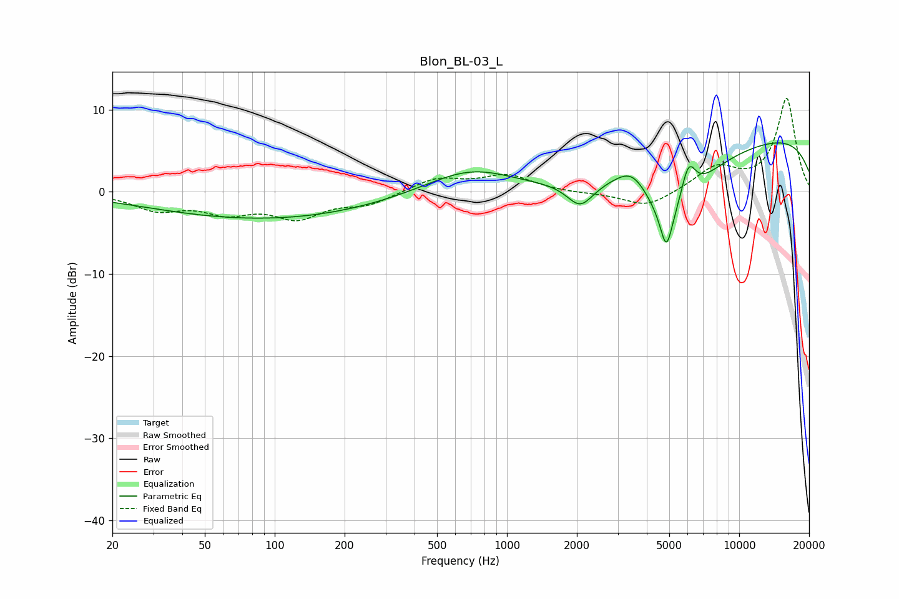

# Blon_BL-03_L
See [usage instructions](https://github.com/jaakkopasanen/AutoEq#usage) for more options and info.

### Parametric EQs
Apply preamp of -6.1 dB when using parametric equalizer.

|   # | Type    |   Fc (Hz) |    Q |   Gain (dB) |
|-----|---------|-----------|------|-------------|
|   1 | Peaking |        91 | 0.29 |        -3.3 |
|   2 | Peaking |       704 | 0.73 |         3.3 |
|   3 | Peaking |      2069 | 2.46 |        -3   |
|   4 | Peaking |      3477 | 1.93 |         3   |
|   5 | Peaking |      3855 | 0.21 |        -2.3 |
|   6 | Peaking |      4858 | 5.59 |        -4.6 |
|   7 | Peaking |      5031 | 1.06 |        -8.2 |
|   8 | Peaking |      6039 | 4.16 |         4.6 |
|   9 | Peaking |      9528 | 0.18 |         1.7 |
|  10 | Peaking |      9729 | 0.18 |         6.2 |

### Fixed Band EQs
When using fixed band (also called graphic) equalizer, apply preamp of **-11.5 dB** (if available) and set gains manually with these parameters.

|   # | Type    |   Fc (Hz) |    Q |   Gain (dB) |
|-----|---------|-----------|------|-------------|
|   1 | Peaking |        31 | 1.41 |        -2   |
|   2 | Peaking |        62 | 1.41 |        -2.1 |
|   3 | Peaking |       125 | 1.41 |        -2.9 |
|   4 | Peaking |       250 | 1.41 |        -1.4 |
|   5 | Peaking |       500 | 1.41 |         1.6 |
|   6 | Peaking |      1000 | 1.41 |         2   |
|   7 | Peaking |      2000 | 1.41 |        -0.2 |
|   8 | Peaking |      4000 | 1.41 |        -2   |
|   9 | Peaking |      8000 | 1.41 |         2.8 |
|  10 | Peaking |     16000 | 1.41 |        11.3 |

### Graphs

