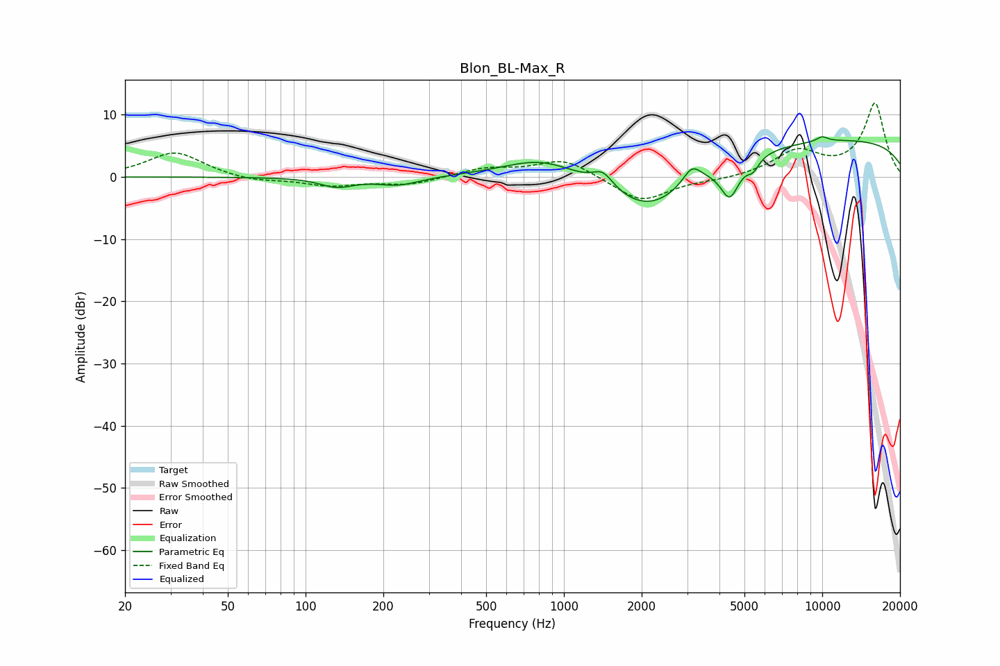

# Blon_BL-Max_R
See [usage instructions](https://github.com/jaakkopasanen/AutoEq#usage) for more options and info.

### Parametric EQs
Apply preamp of -6.6 dB when using parametric equalizer.

|   # | Type    |   Fc (Hz) |    Q |   Gain (dB) |
|-----|---------|-----------|------|-------------|
|   1 | Peaking |       132 | 2.18 |        -1.5 |
|   2 | Peaking |       229 | 1.7  |        -1.3 |
|   3 | Peaking |       824 | 0.94 |         3.3 |
|   4 | Peaking |      1416 | 3.56 |         2.5 |
|   5 | Peaking |      2148 | 0.82 |        -8   |
|   6 | Peaking |      3131 | 3.94 |         2.8 |
|   7 | Peaking |      4388 | 3.82 |        -5.7 |
|   8 | Peaking |      5400 | 5.92 |        -1.8 |
|   9 | Peaking |     10000 | 5.43 |         0.8 |
|  10 | Peaking |     10000 | 0.18 |         6.2 |

### Fixed Band EQs
When using fixed band (also called graphic) equalizer, apply preamp of **-12.0 dB** (if available) and set gains manually with these parameters.

|   # | Type    |   Fc (Hz) |    Q |   Gain (dB) |
|-----|---------|-----------|------|-------------|
|   1 | Peaking |        31 | 1.41 |         4   |
|   2 | Peaking |        62 | 1.41 |        -0.8 |
|   3 | Peaking |       125 | 1.41 |        -1.3 |
|   4 | Peaking |       250 | 1.41 |        -1.2 |
|   5 | Peaking |       500 | 1.41 |         1.3 |
|   6 | Peaking |      1000 | 1.41 |         2.9 |
|   7 | Peaking |      2000 | 1.41 |        -4.1 |
|   8 | Peaking |      4000 | 1.41 |        -0.4 |
|   9 | Peaking |      8000 | 1.41 |         3.9 |
|  10 | Peaking |     16000 | 1.41 |        11.8 |

### Graphs

