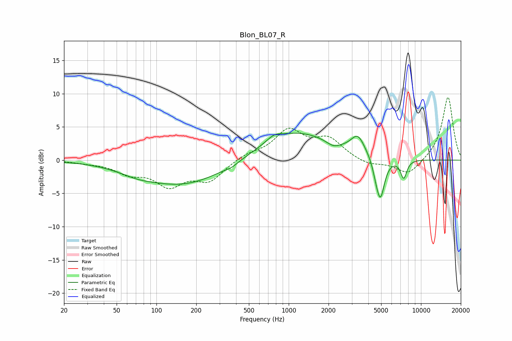

# Blon_BL07_R
See [usage instructions](https://github.com/jaakkopasanen/AutoEq#usage) for more options and info.

### Parametric EQs
Apply preamp of -4.1 dB when using parametric equalizer.

|   # | Type    |   Fc (Hz) |    Q |   Gain (dB) |
|-----|---------|-----------|------|-------------|
|   1 | Peaking |        71 | 1.22 |        -0.6 |
|   2 | Peaking |       159 | 0.44 |        -3.8 |
|   3 | Peaking |       370 | 3.08 |        -0.4 |
|   4 | Peaking |       777 | 2.54 |         0.8 |
|   5 | Peaking |      1135 | 0.5  |         4.3 |
|   6 | Peaking |      2174 | 2.64 |        -0.8 |
|   7 | Peaking |      3335 | 2.74 |         2.7 |
|   8 | Peaking |      4550 | 5.99 |        -1   |
|   9 | Peaking |      4931 | 4.34 |        -6.1 |
|  10 | Peaking |      7402 | 5.6  |        -2.8 |

### Fixed Band EQs
When using fixed band (also called graphic) equalizer, apply preamp of **-9.5 dB** (if available) and set gains manually with these parameters.

|   # | Type    |   Fc (Hz) |    Q |   Gain (dB) |
|-----|---------|-----------|------|-------------|
|   1 | Peaking |        31 | 1.41 |        -0.3 |
|   2 | Peaking |        62 | 1.41 |        -1.7 |
|   3 | Peaking |       125 | 1.41 |        -3.5 |
|   4 | Peaking |       250 | 1.41 |        -2.9 |
|   5 | Peaking |       500 | 1.41 |         0.9 |
|   6 | Peaking |      1000 | 1.41 |         4.3 |
|   7 | Peaking |      2000 | 1.41 |         2.9 |
|   8 | Peaking |      4000 | 1.41 |        -0.8 |
|   9 | Peaking |      8000 | 1.41 |        -2.3 |
|  10 | Peaking |     16000 | 1.41 |         9.6 |

### Graphs

