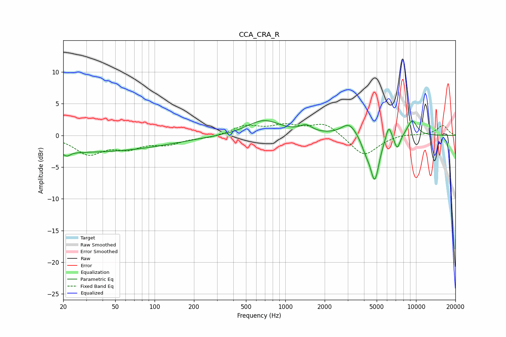

# CCA_CRA_R
See [usage instructions](https://github.com/jaakkopasanen/AutoEq#usage) for more options and info.

### Parametric EQs
Apply preamp of -2.4 dB when using parametric equalizer.

|   # | Type    |   Fc (Hz) |    Q |   Gain (dB) |
|-----|---------|-----------|------|-------------|
|   1 | Peaking |        21 | 5.76 |        -0.6 |
|   2 | Peaking |        25 | 0.18 |        -2.6 |
|   3 | Peaking |       684 | 1.11 |         2.4 |
|   4 | Peaking |      1441 | 3.02 |         1.1 |
|   5 | Peaking |      3081 | 2.38 |         2   |
|   6 | Peaking |      4122 | 3.92 |        -1.6 |
|   7 | Peaking |      4832 | 3.96 |        -6.9 |
|   8 | Peaking |      6179 | 5.82 |         2.4 |
|   9 | Peaking |      7181 | 5.74 |        -2.3 |
|  10 | Peaking |      9340 | 3.27 |         2.5 |

### Fixed Band EQs
When using fixed band (also called graphic) equalizer, apply preamp of **-1.9 dB** (if available) and set gains manually with these parameters.

|   # | Type    |   Fc (Hz) |    Q |   Gain (dB) |
|-----|---------|-----------|------|-------------|
|   1 | Peaking |        31 | 1.41 |        -2.8 |
|   2 | Peaking |        62 | 1.41 |        -1.7 |
|   3 | Peaking |       125 | 1.41 |        -1.2 |
|   4 | Peaking |       250 | 1.41 |        -0.4 |
|   5 | Peaking |       500 | 1.41 |         1.4 |
|   6 | Peaking |      1000 | 1.41 |         1.4 |
|   7 | Peaking |      2000 | 1.41 |         1.9 |
|   8 | Peaking |      4000 | 1.41 |        -3.3 |
|   9 | Peaking |      8000 | 1.41 |         0.3 |
|  10 | Peaking |     16000 | 1.41 |         1.6 |

### Graphs

