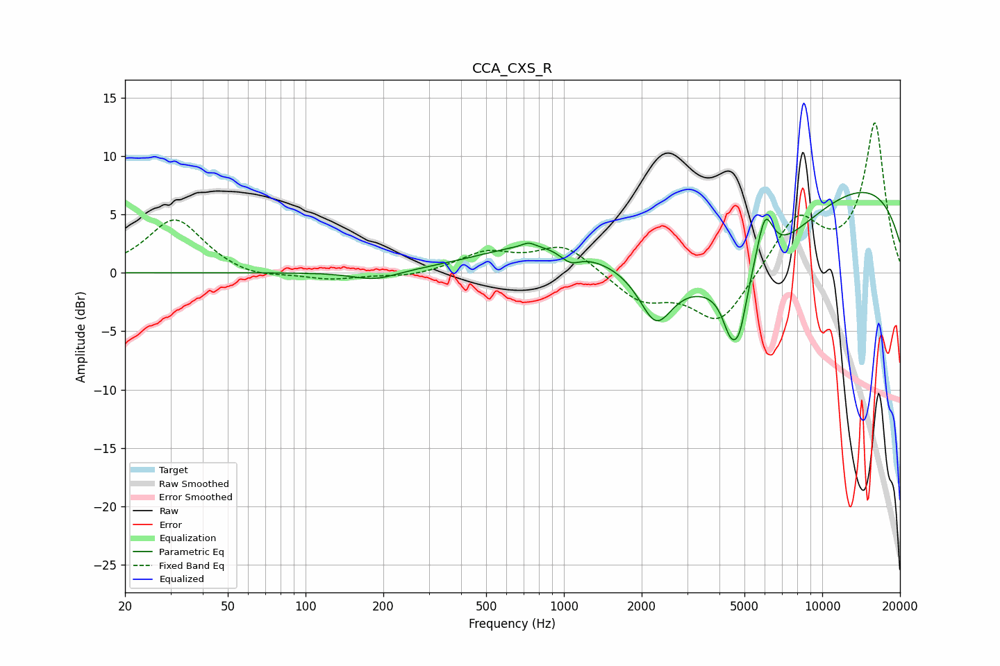

# CCA_CXS_R
See [usage instructions](https://github.com/jaakkopasanen/AutoEq#usage) for more options and info.

### Parametric EQs
Apply preamp of -7.0 dB when using parametric equalizer.

|   # | Type    |   Fc (Hz) |    Q |   Gain (dB) |
|-----|---------|-----------|------|-------------|
|   1 | Peaking |       186 | 1.61 |        -0.8 |
|   2 | Peaking |       730 | 5.99 |         0.4 |
|   3 | Peaking |       791 | 0.64 |         2.3 |
|   4 | Peaking |      1057 | 3.57 |        -1   |
|   5 | Peaking |      2269 | 2.2  |        -4.5 |
|   6 | Peaking |      4425 | 4.2  |        -3.5 |
|   7 | Peaking |      4706 | 0.52 |        -8   |
|   8 | Peaking |      4798 | 4.97 |        -3.1 |
|   9 | Peaking |      5997 | 4.17 |         4.4 |
|  10 | Peaking |      9865 | 0.2  |         9   |

### Fixed Band EQs
When using fixed band (also called graphic) equalizer, apply preamp of **-12.9 dB** (if available) and set gains manually with these parameters.

|   # | Type    |   Fc (Hz) |    Q |   Gain (dB) |
|-----|---------|-----------|------|-------------|
|   1 | Peaking |        31 | 1.41 |         4.7 |
|   2 | Peaking |        62 | 1.41 |        -0.6 |
|   3 | Peaking |       125 | 1.41 |        -0.6 |
|   4 | Peaking |       250 | 1.41 |        -0.4 |
|   5 | Peaking |       500 | 1.41 |         1.6 |
|   6 | Peaking |      1000 | 1.41 |         2.4 |
|   7 | Peaking |      2000 | 1.41 |        -2.3 |
|   8 | Peaking |      4000 | 1.41 |        -4.4 |
|   9 | Peaking |      8000 | 1.41 |         4.7 |
|  10 | Peaking |     16000 | 1.41 |        12.7 |

### Graphs

