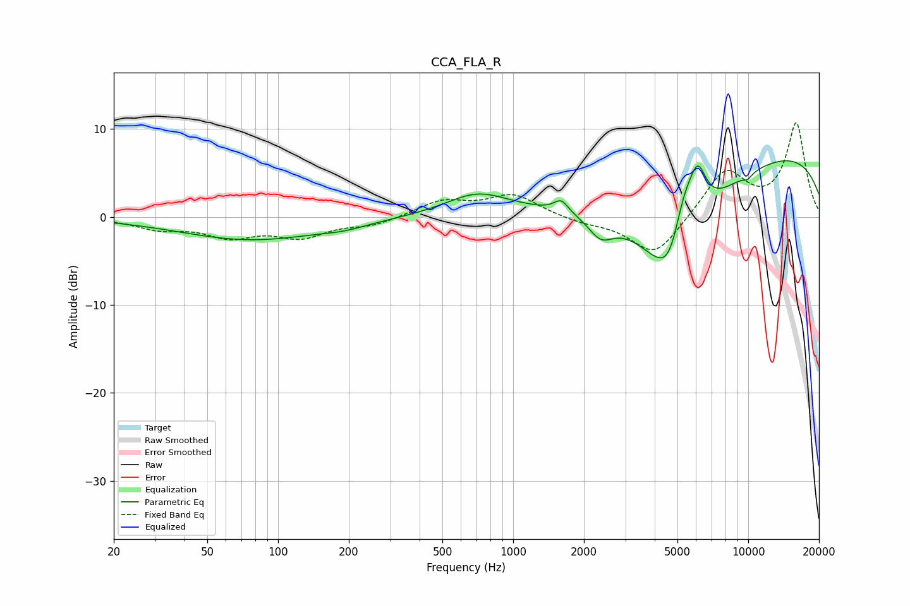

# CCA_FLA_R
See [usage instructions](https://github.com/jaakkopasanen/AutoEq#usage) for more options and info.

### Parametric EQs
Apply preamp of -6.5 dB when using parametric equalizer.

|   # | Type    |   Fc (Hz) |    Q |   Gain (dB) |
|-----|---------|-----------|------|-------------|
|   1 | Peaking |        77 | 0.46 |        -2.6 |
|   2 | Peaking |       192 | 1.47 |        -0.5 |
|   3 | Peaking |       705 | 1.04 |         2.5 |
|   4 | Peaking |      1600 | 4.71 |         1.4 |
|   5 | Peaking |      2357 | 2.66 |        -2.4 |
|   6 | Peaking |      4737 | 1.05 |       -17.4 |
|   7 | Peaking |      5278 | 2.18 |         8.8 |
|   8 | Peaking |      6109 | 3.83 |         4.6 |
|   9 | Peaking |      9909 | 0.19 |         8.1 |
|  10 | Peaking |      9929 | 6    |        -0.6 |

### Fixed Band EQs
When using fixed band (also called graphic) equalizer, apply preamp of **-10.8 dB** (if available) and set gains manually with these parameters.

|   # | Type    |   Fc (Hz) |    Q |   Gain (dB) |
|-----|---------|-----------|------|-------------|
|   1 | Peaking |        31 | 1.41 |        -1.2 |
|   2 | Peaking |        62 | 1.41 |        -2   |
|   3 | Peaking |       125 | 1.41 |        -2.1 |
|   4 | Peaking |       250 | 1.41 |        -0.9 |
|   5 | Peaking |       500 | 1.41 |         1.8 |
|   6 | Peaking |      1000 | 1.41 |         2.5 |
|   7 | Peaking |      2000 | 1.41 |        -0.6 |
|   8 | Peaking |      4000 | 1.41 |        -4.6 |
|   9 | Peaking |      8000 | 1.41 |         5.3 |
|  10 | Peaking |     16000 | 1.41 |        10.6 |

### Graphs

