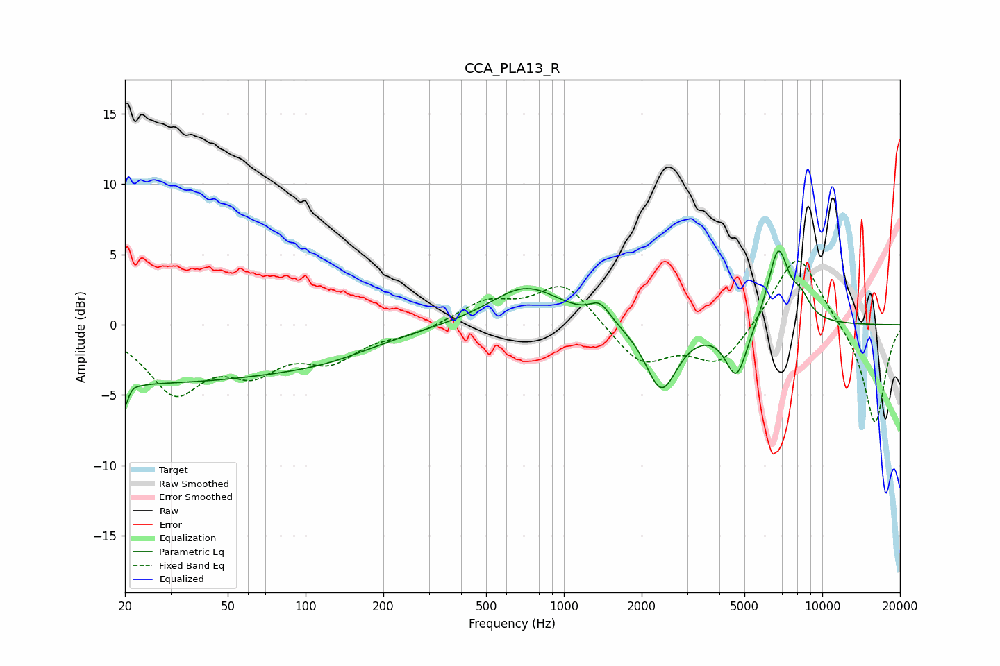

# CCA_PLA13_R
See [usage instructions](https://github.com/jaakkopasanen/AutoEq#usage) for more options and info.

### Parametric EQs
Apply preamp of -5.3 dB when using parametric equalizer.

|   # | Type    |   Fc (Hz) |    Q |   Gain (dB) |
|-----|---------|-----------|------|-------------|
|   1 | Peaking |        20 | 5.94 |        -4.2 |
|   2 | Peaking |        21 | 6    |         2.7 |
|   3 | Peaking |        23 | 0.2  |        -4   |
|   4 | Peaking |       124 | 0.73 |        -0.8 |
|   5 | Peaking |       713 | 1.02 |         2.8 |
|   6 | Peaking |      1379 | 3.54 |         1.2 |
|   7 | Peaking |      2385 | 2.31 |        -4.7 |
|   8 | Peaking |      4658 | 3.31 |        -3.8 |
|   9 | Peaking |      6751 | 3.32 |         5.5 |
|  10 | Peaking |      8283 | 3.66 |         1.4 |

### Fixed Band EQs
When using fixed band (also called graphic) equalizer, apply preamp of **-4.6 dB** (if available) and set gains manually with these parameters.

|   # | Type    |   Fc (Hz) |    Q |   Gain (dB) |
|-----|---------|-----------|------|-------------|
|   1 | Peaking |        31 | 1.41 |        -4.5 |
|   2 | Peaking |        62 | 1.41 |        -2.7 |
|   3 | Peaking |       125 | 1.41 |        -2.2 |
|   4 | Peaking |       250 | 1.41 |        -0.6 |
|   5 | Peaking |       500 | 1.41 |         1.6 |
|   6 | Peaking |      1000 | 1.41 |         3   |
|   7 | Peaking |      2000 | 1.41 |        -2.8 |
|   8 | Peaking |      4000 | 1.41 |        -2.9 |
|   9 | Peaking |      8000 | 1.41 |         5.4 |
|  10 | Peaking |     16000 | 1.41 |        -7.2 |

### Graphs

