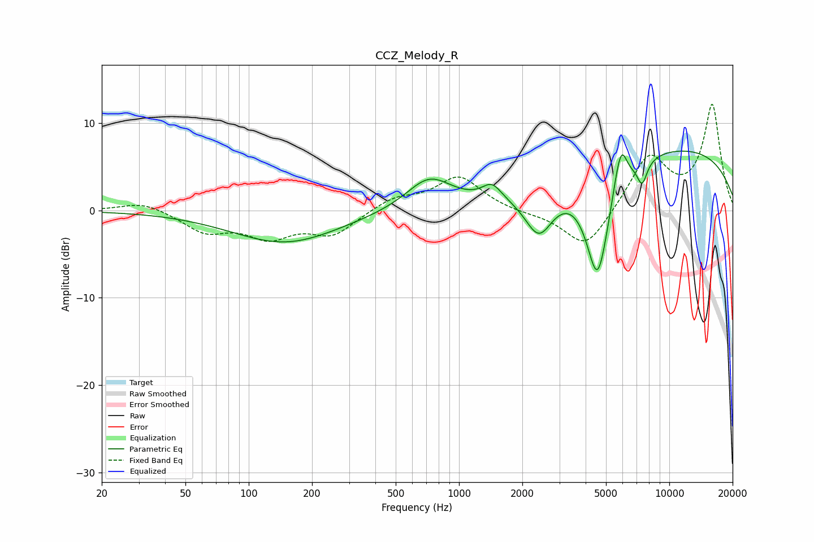

# CCZ_Melody_R
See [usage instructions](https://github.com/jaakkopasanen/AutoEq#usage) for more options and info.

### Parametric EQs
Apply preamp of -6.9 dB when using parametric equalizer.

|   # | Type    |   Fc (Hz) |    Q |   Gain (dB) |
|-----|---------|-----------|------|-------------|
|   1 | Peaking |       149 | 0.56 |        -3.7 |
|   2 | Peaking |       721 | 1.29 |         3.7 |
|   3 | Peaking |      1434 | 3.05 |         1.8 |
|   4 | Peaking |      2400 | 2.07 |        -5.2 |
|   5 | Peaking |      4559 | 2.92 |        -8.4 |
|   6 | Peaking |      4587 | 1.84 |        -4   |
|   7 | Peaking |      5675 | 5.07 |         1.9 |
|   8 | Peaking |      5961 | 5.5  |         3   |
|   9 | Peaking |      7426 | 5.46 |        -2.7 |
|  10 | Peaking |     10000 | 0.23 |         7.2 |

### Fixed Band EQs
When using fixed band (also called graphic) equalizer, apply preamp of **-12.2 dB** (if available) and set gains manually with these parameters.

|   # | Type    |   Fc (Hz) |    Q |   Gain (dB) |
|-----|---------|-----------|------|-------------|
|   1 | Peaking |        31 | 1.41 |         1.1 |
|   2 | Peaking |        62 | 1.41 |        -2.3 |
|   3 | Peaking |       125 | 1.41 |        -2.7 |
|   4 | Peaking |       250 | 1.41 |        -2.6 |
|   5 | Peaking |       500 | 1.41 |         1.4 |
|   6 | Peaking |      1000 | 1.41 |         3.8 |
|   7 | Peaking |      2000 | 1.41 |        -0.3 |
|   8 | Peaking |      4000 | 1.41 |        -4.6 |
|   9 | Peaking |      8000 | 1.41 |         6.2 |
|  10 | Peaking |     16000 | 1.41 |        12   |

### Graphs

