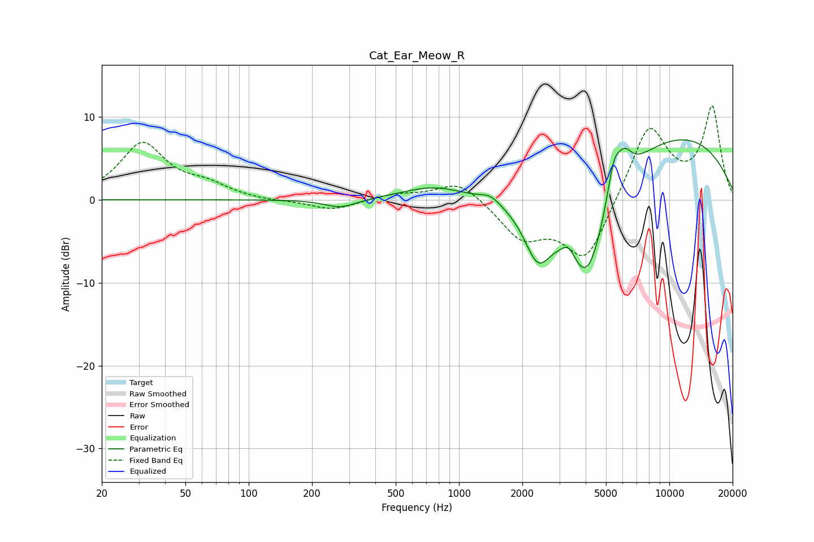

# Cat_Ear_Meow_R
See [usage instructions](https://github.com/jaakkopasanen/AutoEq#usage) for more options and info.

### Parametric EQs
Apply preamp of -7.3 dB when using parametric equalizer.

|   # | Type    |   Fc (Hz) |    Q |   Gain (dB) |
|-----|---------|-----------|------|-------------|
|   1 | Peaking |       273 | 1.82 |        -1.1 |
|   2 | Peaking |       761 | 0.94 |         1.6 |
|   3 | Peaking |      1410 | 3    |         0.9 |
|   4 | Peaking |      2368 | 2.17 |        -6.1 |
|   5 | Peaking |      3335 | 4.17 |         1.9 |
|   6 | Peaking |      3919 | 1.14 |       -10.3 |
|   7 | Peaking |      4174 | 2.11 |        -3.3 |
|   8 | Peaking |      5436 | 4.45 |         4.2 |
|   9 | Peaking |      6103 | 3.61 |         3   |
|  10 | Peaking |     10000 | 0.3  |         8.1 |

### Fixed Band EQs
When using fixed band (also called graphic) equalizer, apply preamp of **-11.4 dB** (if available) and set gains manually with these parameters.

|   # | Type    |   Fc (Hz) |    Q |   Gain (dB) |
|-----|---------|-----------|------|-------------|
|   1 | Peaking |        31 | 1.41 |         6.7 |
|   2 | Peaking |        62 | 1.41 |         1.5 |
|   3 | Peaking |       125 | 1.41 |        -0.2 |
|   4 | Peaking |       250 | 1.41 |        -1.3 |
|   5 | Peaking |       500 | 1.41 |         0.7 |
|   6 | Peaking |      1000 | 1.41 |         2.5 |
|   7 | Peaking |      2000 | 1.41 |        -4.3 |
|   8 | Peaking |      4000 | 1.41 |        -7.5 |
|   9 | Peaking |      8000 | 1.41 |         9.1 |
|  10 | Peaking |     16000 | 1.41 |        11   |

### Graphs

