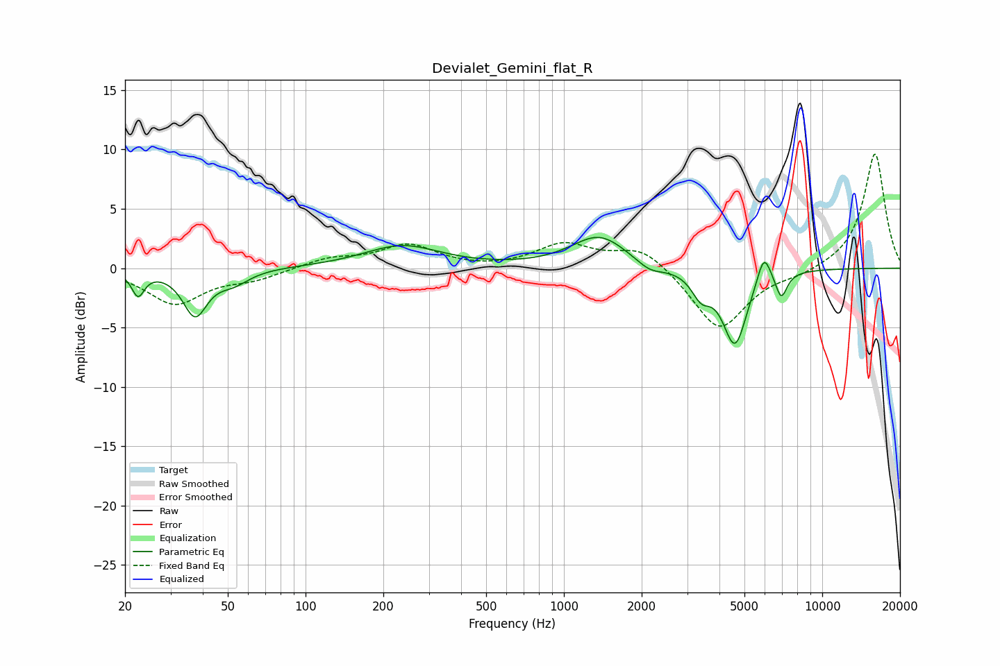

# Devialet_Gemini_flat_R
See [usage instructions](https://github.com/jaakkopasanen/AutoEq#usage) for more options and info.

### Parametric EQs
Apply preamp of -2.7 dB when using parametric equalizer.

|   # | Type    |   Fc (Hz) |    Q |   Gain (dB) |
|-----|---------|-----------|------|-------------|
|   1 | Peaking |        22 | 5.95 |        -2   |
|   2 | Peaking |        37 | 3.06 |        -3.8 |
|   3 | Peaking |        53 | 2.32 |        -1   |
|   4 | Peaking |       236 | 0.96 |         1.9 |
|   5 | Peaking |      1372 | 1.31 |         2.7 |
|   6 | Peaking |      2148 | 2.59 |        -0.8 |
|   7 | Peaking |      3398 | 3.85 |        -1.8 |
|   8 | Peaking |      4593 | 2.94 |        -6.4 |
|   9 | Peaking |      5943 | 5.17 |         2.6 |
|  10 | Peaking |      6941 | 6    |        -2.2 |

### Fixed Band EQs
When using fixed band (also called graphic) equalizer, apply preamp of **-9.7 dB** (if available) and set gains manually with these parameters.

|   # | Type    |   Fc (Hz) |    Q |   Gain (dB) |
|-----|---------|-----------|------|-------------|
|   1 | Peaking |        31 | 1.41 |        -3   |
|   2 | Peaking |        62 | 1.41 |        -0.8 |
|   3 | Peaking |       125 | 1.41 |         0.8 |
|   4 | Peaking |       250 | 1.41 |         1.9 |
|   5 | Peaking |       500 | 1.41 |        -0.1 |
|   6 | Peaking |      1000 | 1.41 |         2   |
|   7 | Peaking |      2000 | 1.41 |         1.9 |
|   8 | Peaking |      4000 | 1.41 |        -5.3 |
|   9 | Peaking |      8000 | 1.41 |        -0.5 |
|  10 | Peaking |     16000 | 1.41 |         9.7 |

### Graphs

