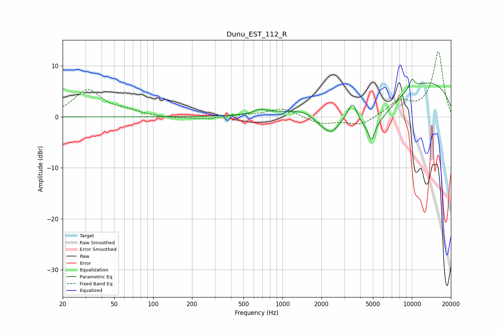

# Dunu_EST_112_R
See [usage instructions](https://github.com/jaakkopasanen/AutoEq#usage) for more options and info.

### Parametric EQs
Apply preamp of -7.5 dB when using parametric equalizer.

|   # | Type    |   Fc (Hz) |    Q |   Gain (dB) |
|-----|---------|-----------|------|-------------|
|   1 | Peaking |       636 | 2.52 |        -1.5 |
|   2 | Peaking |       650 | 2.52 |         2.3 |
|   3 | Peaking |      1491 | 3.59 |         0.2 |
|   4 | Peaking |      1959 | 2.04 |        -1.6 |
|   5 | Peaking |      2399 | 2.12 |        -3.7 |
|   6 | Peaking |      3480 | 3.91 |         3.9 |
|   7 | Peaking |      4777 | 0.73 |        -9.4 |
|   8 | Peaking |      4871 | 5.99 |        -3.2 |
|   9 | Peaking |      8471 | 0.19 |         8.7 |
|  10 | Peaking |     10000 | 5.94 |         1.9 |

### Fixed Band EQs
When using fixed band (also called graphic) equalizer, apply preamp of **-12.9 dB** (if available) and set gains manually with these parameters.

|   # | Type    |   Fc (Hz) |    Q |   Gain (dB) |
|-----|---------|-----------|------|-------------|
|   1 | Peaking |        31 | 1.41 |         5.2 |
|   2 | Peaking |        62 | 1.41 |         0.9 |
|   3 | Peaking |       125 | 1.41 |        -0.3 |
|   4 | Peaking |       250 | 1.41 |        -0.5 |
|   5 | Peaking |       500 | 1.41 |         0.3 |
|   6 | Peaking |      1000 | 1.41 |         1.7 |
|   7 | Peaking |      2000 | 1.41 |        -1.4 |
|   8 | Peaking |      4000 | 1.41 |        -1.7 |
|   9 | Peaking |      8000 | 1.41 |         2.8 |
|  10 | Peaking |     16000 | 1.41 |        12.8 |

### Graphs

