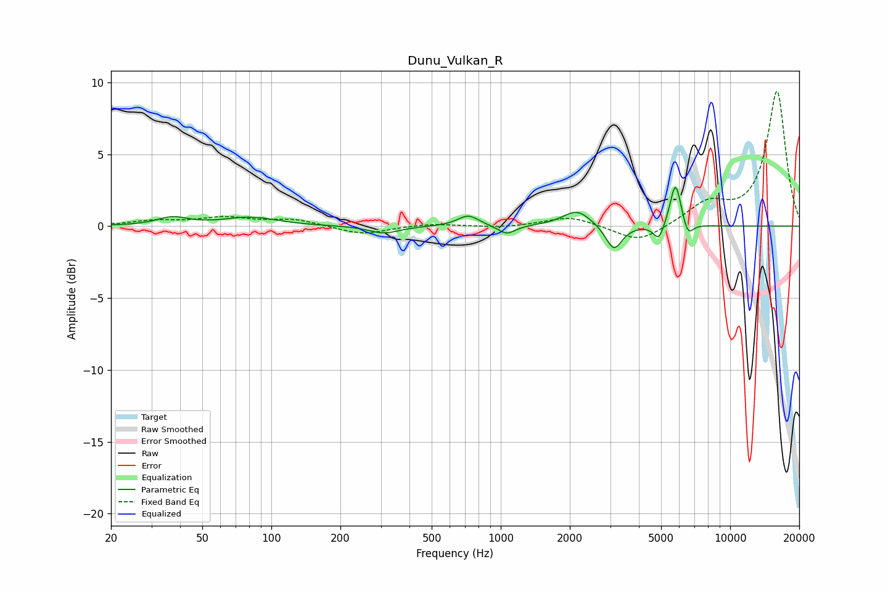

# Dunu_Vulkan_R
See [usage instructions](https://github.com/jaakkopasanen/AutoEq#usage) for more options and info.

### Parametric EQs
Apply preamp of -2.8 dB when using parametric equalizer.

|   # | Type    |   Fc (Hz) |    Q |   Gain (dB) |
|-----|---------|-----------|------|-------------|
|   1 | Peaking |        37 | 2.15 |         0.6 |
|   2 | Peaking |        81 | 1.23 |         0.6 |
|   3 | Peaking |       310 | 2.12 |        -0.5 |
|   4 | Peaking |       721 | 3.11 |         0.8 |
|   5 | Peaking |      1062 | 3.78 |        -0.6 |
|   6 | Peaking |      2149 | 2.31 |         1.1 |
|   7 | Peaking |      3113 | 3.99 |        -1.8 |
|   8 | Peaking |      4892 | 6    |        -1.2 |
|   9 | Peaking |      5782 | 5.74 |         3.2 |
|  10 | Peaking |      6539 | 6    |        -1   |

### Fixed Band EQs
When using fixed band (also called graphic) equalizer, apply preamp of **-9.5 dB** (if available) and set gains manually with these parameters.

|   # | Type    |   Fc (Hz) |    Q |   Gain (dB) |
|-----|---------|-----------|------|-------------|
|   1 | Peaking |        31 | 1.41 |         0.3 |
|   2 | Peaking |        62 | 1.41 |         0.6 |
|   3 | Peaking |       125 | 1.41 |         0.5 |
|   4 | Peaking |       250 | 1.41 |        -0.6 |
|   5 | Peaking |       500 | 1.41 |         0.2 |
|   6 | Peaking |      1000 | 1.41 |        -0.1 |
|   7 | Peaking |      2000 | 1.41 |         0.7 |
|   8 | Peaking |      4000 | 1.41 |        -1.2 |
|   9 | Peaking |      8000 | 1.41 |         1.5 |
|  10 | Peaking |     16000 | 1.41 |         9.4 |

### Graphs

