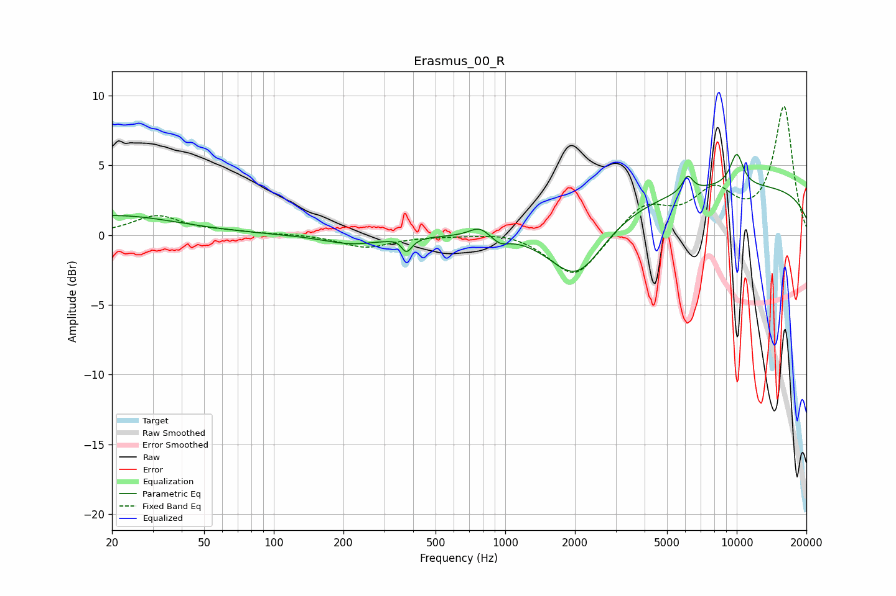

# Erasmus_00_R
See [usage instructions](https://github.com/jaakkopasanen/AutoEq#usage) for more options and info.

### Parametric EQs
Apply preamp of -5.9 dB when using parametric equalizer.

|   # | Type    |   Fc (Hz) |    Q |   Gain (dB) |
|-----|---------|-----------|------|-------------|
|   1 | Peaking |        20 | 0.52 |         1.4 |
|   2 | Peaking |       218 | 1.13 |        -0.6 |
|   3 | Peaking |       346 | 5.85 |         0.2 |
|   4 | Peaking |       374 | 5.96 |        -1.1 |
|   5 | Peaking |       773 | 3.29 |         0.7 |
|   6 | Peaking |       948 | 3.94 |        -0.5 |
|   7 | Peaking |      2035 | 1.19 |        -4.2 |
|   8 | Peaking |      6140 | 6    |         1.1 |
|   9 | Peaking |     10000 | 0.18 |         3.5 |
|  10 | Peaking |     10000 | 4.23 |         2.3 |

### Fixed Band EQs
When using fixed band (also called graphic) equalizer, apply preamp of **-9.3 dB** (if available) and set gains manually with these parameters.

|   # | Type    |   Fc (Hz) |    Q |   Gain (dB) |
|-----|---------|-----------|------|-------------|
|   1 | Peaking |        31 | 1.41 |         1.4 |
|   2 | Peaking |        62 | 1.41 |         0.2 |
|   3 | Peaking |       125 | 1.41 |         0.1 |
|   4 | Peaking |       250 | 1.41 |        -0.9 |
|   5 | Peaking |       500 | 1.41 |        -0   |
|   6 | Peaking |      1000 | 1.41 |         0.3 |
|   7 | Peaking |      2000 | 1.41 |        -3.2 |
|   8 | Peaking |      4000 | 1.41 |         2.1 |
|   9 | Peaking |      8000 | 1.41 |         2.8 |
|  10 | Peaking |     16000 | 1.41 |         9.1 |

### Graphs

