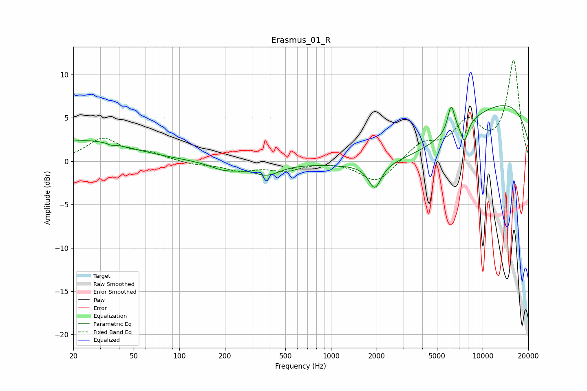

# Erasmus_01_R
See [usage instructions](https://github.com/jaakkopasanen/AutoEq#usage) for more options and info.

### Parametric EQs
Apply preamp of -6.5 dB when using parametric equalizer.

|   # | Type    |   Fc (Hz) |    Q |   Gain (dB) |
|-----|---------|-----------|------|-------------|
|   1 | Peaking |        24 | 0.47 |         2.4 |
|   2 | Peaking |        35 | 5.91 |         1.6 |
|   3 | Peaking |        35 | 5.94 |        -1.8 |
|   4 | Peaking |       201 | 1.41 |        -0.9 |
|   5 | Peaking |       377 | 1.56 |        -1.4 |
|   6 | Peaking |      1944 | 3.41 |        -2.8 |
|   7 | Peaking |      3527 | 0.38 |        -5.3 |
|   8 | Peaking |      6200 | 5.93 |         3.1 |
|   9 | Peaking |      7585 | 5.39 |        -2.3 |
|  10 | Peaking |      9192 | 0.18 |         8   |

### Fixed Band EQs
When using fixed band (also called graphic) equalizer, apply preamp of **-11.7 dB** (if available) and set gains manually with these parameters.

|   # | Type    |   Fc (Hz) |    Q |   Gain (dB) |
|-----|---------|-----------|------|-------------|
|   1 | Peaking |        31 | 1.41 |         2.5 |
|   2 | Peaking |        62 | 1.41 |         0.8 |
|   3 | Peaking |       125 | 1.41 |        -0.4 |
|   4 | Peaking |       250 | 1.41 |        -1   |
|   5 | Peaking |       500 | 1.41 |        -0.9 |
|   6 | Peaking |      1000 | 1.41 |         0.1 |
|   7 | Peaking |      2000 | 1.41 |        -2.6 |
|   8 | Peaking |      4000 | 1.41 |         1.9 |
|   9 | Peaking |      8000 | 1.41 |         4.1 |
|  10 | Peaking |     16000 | 1.41 |        11.5 |

### Graphs

