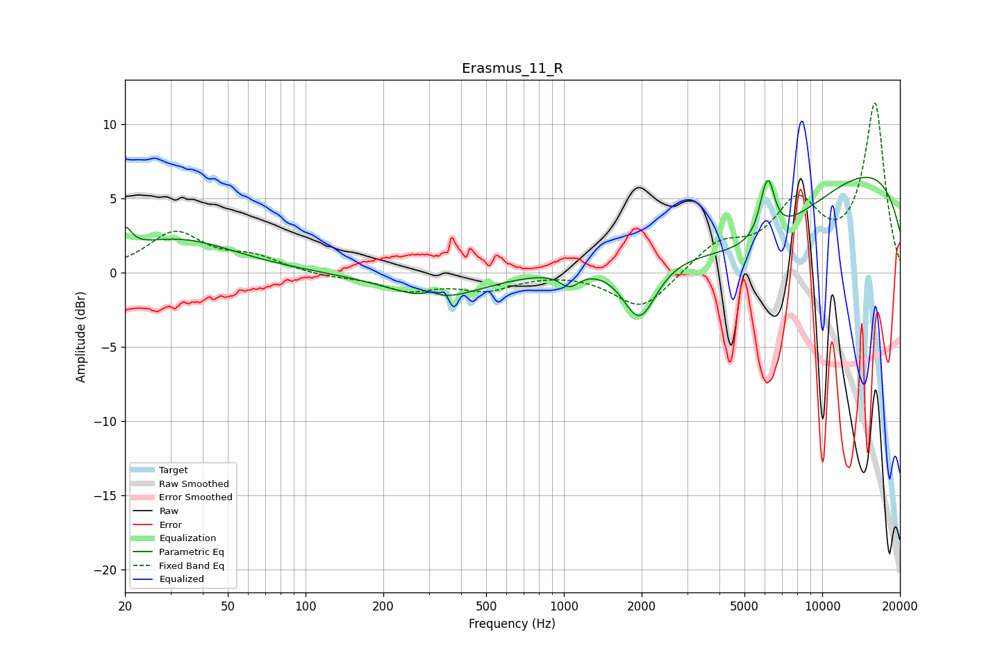

# Erasmus_11_R
See [usage instructions](https://github.com/jaakkopasanen/AutoEq#usage) for more options and info.

### Parametric EQs
Apply preamp of -6.5 dB when using parametric equalizer.

|   # | Type    |   Fc (Hz) |    Q |   Gain (dB) |
|-----|---------|-----------|------|-------------|
|   1 | Peaking |        20 | 5.61 |         1.5 |
|   2 | Peaking |        32 | 0.65 |         2.2 |
|   3 | Peaking |       305 | 5.28 |         0.3 |
|   4 | Peaking |       322 | 0.81 |        -1.8 |
|   5 | Peaking |      1051 | 3.82 |        -1   |
|   6 | Peaking |      1963 | 2.15 |        -4.1 |
|   7 | Peaking |      5339 | 0.45 |        -5.5 |
|   8 | Peaking |      5947 | 5.71 |         1.4 |
|   9 | Peaking |      6225 | 5.8  |         2.7 |
|  10 | Peaking |     10000 | 0.19 |         8.4 |

### Fixed Band EQs
When using fixed band (also called graphic) equalizer, apply preamp of **-11.5 dB** (if available) and set gains manually with these parameters.

|   # | Type    |   Fc (Hz) |    Q |   Gain (dB) |
|-----|---------|-----------|------|-------------|
|   1 | Peaking |        31 | 1.41 |         2.6 |
|   2 | Peaking |        62 | 1.41 |         0.9 |
|   3 | Peaking |       125 | 1.41 |        -0.3 |
|   4 | Peaking |       250 | 1.41 |        -1.1 |
|   5 | Peaking |       500 | 1.41 |        -1   |
|   6 | Peaking |      1000 | 1.41 |         0.1 |
|   7 | Peaking |      2000 | 1.41 |        -2.5 |
|   8 | Peaking |      4000 | 1.41 |         1.8 |
|   9 | Peaking |      8000 | 1.41 |         4.3 |
|  10 | Peaking |     16000 | 1.41 |        11.3 |

### Graphs

