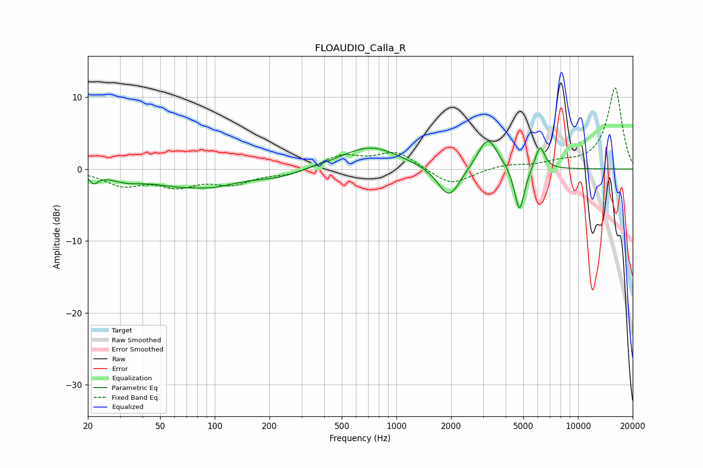

# FLOAUDIO_Calla_R
See [usage instructions](https://github.com/jaakkopasanen/AutoEq#usage) for more options and info.

### Parametric EQs
Apply preamp of -3.9 dB when using parametric equalizer.

|   # | Type    |   Fc (Hz) |    Q |   Gain (dB) |
|-----|---------|-----------|------|-------------|
|   1 | Peaking |        22 | 5.97 |        -1.2 |
|   2 | Peaking |        32 | 1.5  |        -1   |
|   3 | Peaking |        76 | 1.95 |         0.3 |
|   4 | Peaking |        80 | 0.68 |        -2.8 |
|   5 | Peaking |       227 | 1.2  |        -0.8 |
|   6 | Peaking |       719 | 0.88 |         3.2 |
|   7 | Peaking |      1950 | 2.29 |        -4.5 |
|   8 | Peaking |      3185 | 2.52 |         4.6 |
|   9 | Peaking |      4761 | 5.02 |        -6.5 |
|  10 | Peaking |      6170 | 5.15 |         3.4 |

### Fixed Band EQs
When using fixed band (also called graphic) equalizer, apply preamp of **-11.4 dB** (if available) and set gains manually with these parameters.

|   # | Type    |   Fc (Hz) |    Q |   Gain (dB) |
|-----|---------|-----------|------|-------------|
|   1 | Peaking |        31 | 1.41 |        -2.1 |
|   2 | Peaking |        62 | 1.41 |        -2.1 |
|   3 | Peaking |       125 | 1.41 |        -1.8 |
|   4 | Peaking |       250 | 1.41 |        -0.7 |
|   5 | Peaking |       500 | 1.41 |         1.8 |
|   6 | Peaking |      1000 | 1.41 |         2.4 |
|   7 | Peaking |      2000 | 1.41 |        -2.4 |
|   8 | Peaking |      4000 | 1.41 |         0.6 |
|   9 | Peaking |      8000 | 1.41 |         0.7 |
|  10 | Peaking |     16000 | 1.41 |        11.3 |

### Graphs

