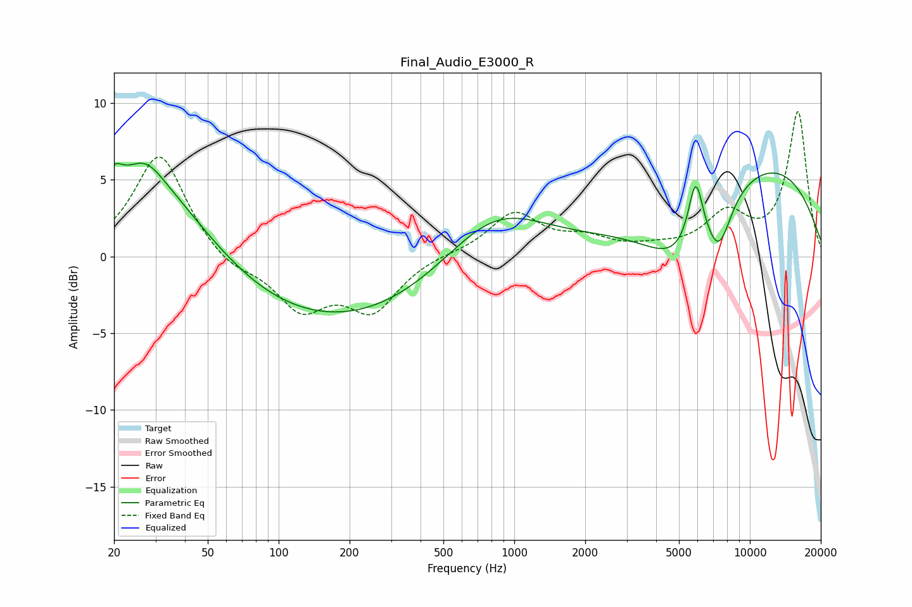

# Final_Audio_E3000_R
See [usage instructions](https://github.com/jaakkopasanen/AutoEq#usage) for more options and info.

### Parametric EQs
Apply preamp of -6.2 dB when using parametric equalizer.

|   # | Type    |   Fc (Hz) |    Q |   Gain (dB) |
|-----|---------|-----------|------|-------------|
|   1 | Peaking |        20 | 5.37 |         3.5 |
|   2 | Peaking |        20 | 5.81 |        -2.4 |
|   3 | Peaking |        27 | 2.06 |         1.3 |
|   4 | Peaking |        28 | 0.55 |         5.9 |
|   5 | Peaking |       160 | 0.28 |        -4.5 |
|   6 | Peaking |       818 | 0.65 |         3.6 |
|   7 | Peaking |      5118 | 0.84 |        -4.7 |
|   8 | Peaking |      5884 | 4.36 |         4.2 |
|   9 | Peaking |      7407 | 2.64 |        -2.8 |
|  10 | Peaking |     10000 | 0.3  |         6.5 |

### Fixed Band EQs
When using fixed band (also called graphic) equalizer, apply preamp of **-9.5 dB** (if available) and set gains manually with these parameters.

|   # | Type    |   Fc (Hz) |    Q |   Gain (dB) |
|-----|---------|-----------|------|-------------|
|   1 | Peaking |        31 | 1.41 |         6.8 |
|   2 | Peaking |        62 | 1.41 |        -1   |
|   3 | Peaking |       125 | 1.41 |        -3.2 |
|   4 | Peaking |       250 | 1.41 |        -3.3 |
|   5 | Peaking |       500 | 1.41 |         0.2 |
|   6 | Peaking |      1000 | 1.41 |         2.8 |
|   7 | Peaking |      2000 | 1.41 |         1   |
|   8 | Peaking |      4000 | 1.41 |         0.4 |
|   9 | Peaking |      8000 | 1.41 |         2.6 |
|  10 | Peaking |     16000 | 1.41 |         9.4 |

### Graphs

