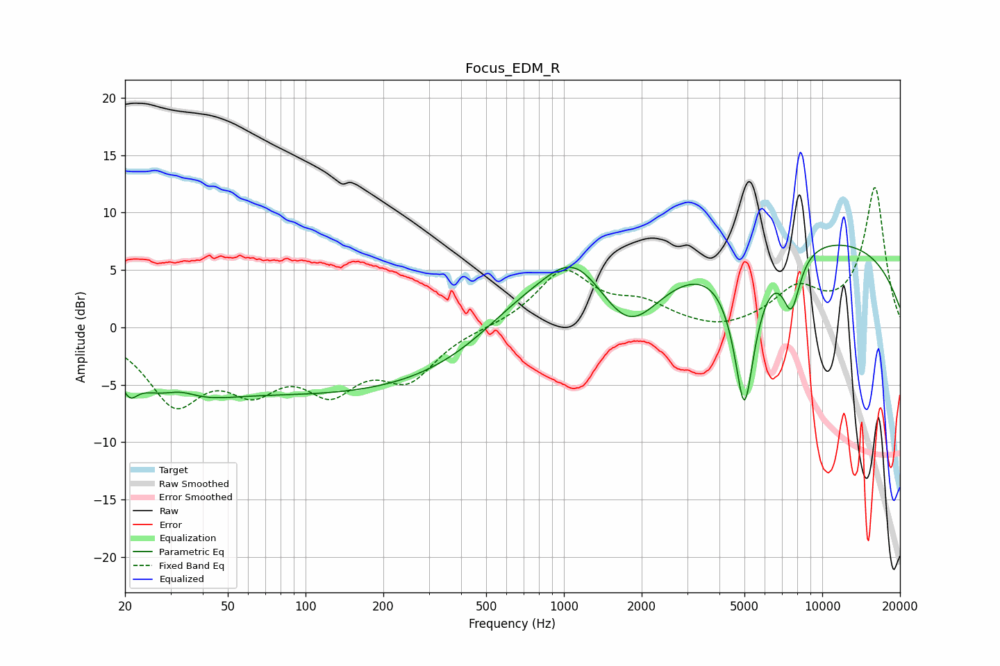

# Focus_EDM_R
See [usage instructions](https://github.com/jaakkopasanen/AutoEq#usage) for more options and info.

### Parametric EQs
Apply preamp of -7.3 dB when using parametric equalizer.

|   # | Type    |   Fc (Hz) |    Q |   Gain (dB) |
|-----|---------|-----------|------|-------------|
|   1 | Peaking |        21 | 4.82 |        -1.8 |
|   2 | Peaking |        31 | 0.94 |        -4.9 |
|   3 | Peaking |        32 | 1.69 |         2.4 |
|   4 | Peaking |       143 | 0.22 |        -5.6 |
|   5 | Peaking |       651 | 0.8  |         2.6 |
|   6 | Peaking |      1092 | 1.1  |         4.9 |
|   7 | Peaking |      1791 | 1.15 |        -5.3 |
|   8 | Peaking |      4996 | 3.19 |       -13.4 |
|   9 | Peaking |      7599 | 3.86 |        -4.8 |
|  10 | Peaking |      7837 | 0.19 |         8.1 |

### Fixed Band EQs
When using fixed band (also called graphic) equalizer, apply preamp of **-12.3 dB** (if available) and set gains manually with these parameters.

|   # | Type    |   Fc (Hz) |    Q |   Gain (dB) |
|-----|---------|-----------|------|-------------|
|   1 | Peaking |        31 | 1.41 |        -6.1 |
|   2 | Peaking |        62 | 1.41 |        -4.2 |
|   3 | Peaking |       125 | 1.41 |        -4.6 |
|   4 | Peaking |       250 | 1.41 |        -4   |
|   5 | Peaking |       500 | 1.41 |        -0   |
|   6 | Peaking |      1000 | 1.41 |         4.8 |
|   7 | Peaking |      2000 | 1.41 |         1.7 |
|   8 | Peaking |      4000 | 1.41 |        -0.6 |
|   9 | Peaking |      8000 | 1.41 |         3   |
|  10 | Peaking |     16000 | 1.41 |        12.1 |

### Graphs

