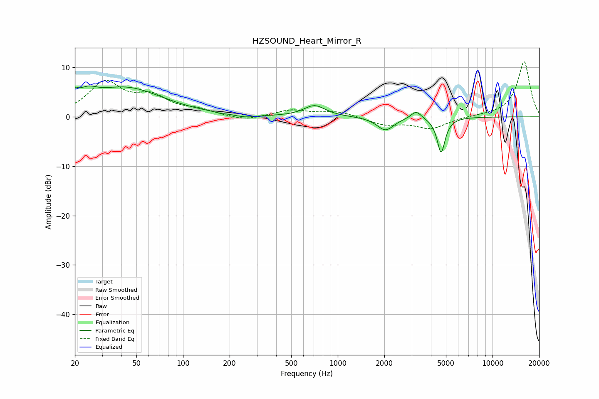

# HZSOUND_Heart_Mirror_R
See [usage instructions](https://github.com/jaakkopasanen/AutoEq#usage) for more options and info.

### Parametric EQs
Apply preamp of -6.4 dB when using parametric equalizer.

|   # | Type    |   Fc (Hz) |    Q |   Gain (dB) |
|-----|---------|-----------|------|-------------|
|   1 | Peaking |        20 | 5.95 |         1.8 |
|   2 | Peaking |        24 | 2.39 |         2.1 |
|   3 | Peaking |        43 | 0.59 |         5.8 |
|   4 | Peaking |       176 | 5.97 |        -0.2 |
|   5 | Peaking |       252 | 2.15 |        -0.6 |
|   6 | Peaking |       708 | 2.06 |         2.3 |
|   7 | Peaking |      2033 | 2.6  |        -2.7 |
|   8 | Peaking |      3213 | 4.3  |         1.6 |
|   9 | Peaking |      4596 | 5.39 |         0.9 |
|  10 | Peaking |      4648 | 5.44 |        -8.1 |

### Fixed Band EQs
When using fixed band (also called graphic) equalizer, apply preamp of **-11.2 dB** (if available) and set gains manually with these parameters.

|   # | Type    |   Fc (Hz) |    Q |   Gain (dB) |
|-----|---------|-----------|------|-------------|
|   1 | Peaking |        31 | 1.41 |         6.7 |
|   2 | Peaking |        62 | 1.41 |         3.5 |
|   3 | Peaking |       125 | 1.41 |         1.1 |
|   4 | Peaking |       250 | 1.41 |        -0.9 |
|   5 | Peaking |       500 | 1.41 |         1.3 |
|   6 | Peaking |      1000 | 1.41 |         1.1 |
|   7 | Peaking |      2000 | 1.41 |        -1.5 |
|   8 | Peaking |      4000 | 1.41 |        -2.3 |
|   9 | Peaking |      8000 | 1.41 |         0.1 |
|  10 | Peaking |     16000 | 1.41 |        11.2 |

### Graphs

