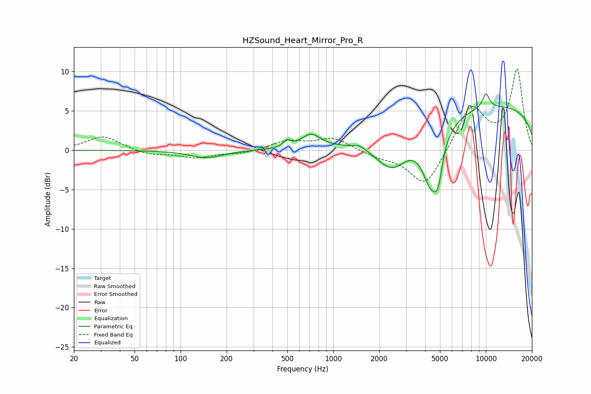

# HZSound_Heart_Mirror_Pro_R
See [usage instructions](https://github.com/jaakkopasanen/AutoEq#usage) for more options and info.

### Parametric EQs
Apply preamp of -7.3 dB when using parametric equalizer.

|   # | Type    |   Fc (Hz) |    Q |   Gain (dB) |
|-----|---------|-----------|------|-------------|
|   1 | Peaking |       147 | 1.34 |        -1   |
|   2 | Peaking |       498 | 5.98 |         0.8 |
|   3 | Peaking |       714 | 2.3  |         1.8 |
|   4 | Peaking |      1486 | 3.63 |         0.5 |
|   5 | Peaking |      2429 | 1.27 |        -4.7 |
|   6 | Peaking |      4378 | 2.31 |        -7.3 |
|   7 | Peaking |      4812 | 4.59 |        -1   |
|   8 | Peaking |      4878 | 6    |        -2.2 |
|   9 | Peaking |     10000 | 0.18 |         5.7 |
|  10 | Peaking |     10000 | 5.25 |         1.9 |

### Fixed Band EQs
When using fixed band (also called graphic) equalizer, apply preamp of **-10.4 dB** (if available) and set gains manually with these parameters.

|   # | Type    |   Fc (Hz) |    Q |   Gain (dB) |
|-----|---------|-----------|------|-------------|
|   1 | Peaking |        31 | 1.41 |         1.8 |
|   2 | Peaking |        62 | 1.41 |        -0.6 |
|   3 | Peaking |       125 | 1.41 |        -0.9 |
|   4 | Peaking |       250 | 1.41 |        -0.4 |
|   5 | Peaking |       500 | 1.41 |         1.1 |
|   6 | Peaking |      1000 | 1.41 |         1.5 |
|   7 | Peaking |      2000 | 1.41 |        -0.7 |
|   8 | Peaking |      4000 | 1.41 |        -4.8 |
|   9 | Peaking |      8000 | 1.41 |         5.6 |
|  10 | Peaking |     16000 | 1.41 |        10.1 |

### Graphs

