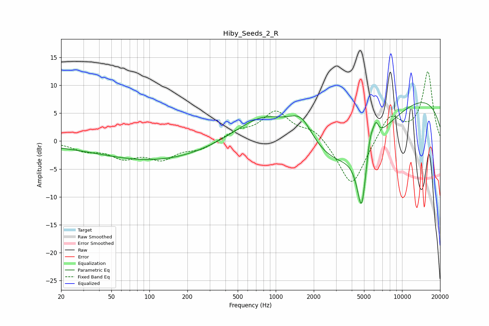

# Hiby_Seeds_2_R
See [usage instructions](https://github.com/jaakkopasanen/AutoEq#usage) for more options and info.

### Parametric EQs
Apply preamp of -7.0 dB when using parametric equalizer.

|   # | Type    |   Fc (Hz) |    Q |   Gain (dB) |
|-----|---------|-----------|------|-------------|
|   1 | Peaking |        22 | 0.29 |        -0.6 |
|   2 | Peaking |       120 | 0.34 |        -3.3 |
|   3 | Peaking |       843 | 0.62 |         5.9 |
|   4 | Peaking |      1011 | 0.49 |         1.3 |
|   5 | Peaking |      1590 | 1.4  |         5.3 |
|   6 | Peaking |      3155 | 0.35 |       -11.3 |
|   7 | Peaking |      4783 | 3.66 |       -11.6 |
|   8 | Peaking |      5592 | 4.98 |         3.7 |
|   9 | Peaking |      6197 | 6    |         2.8 |
|  10 | Peaking |      9531 | 0.21 |         9.9 |

### Fixed Band EQs
When using fixed band (also called graphic) equalizer, apply preamp of **-12.5 dB** (if available) and set gains manually with these parameters.

|   # | Type    |   Fc (Hz) |    Q |   Gain (dB) |
|-----|---------|-----------|------|-------------|
|   1 | Peaking |        31 | 1.41 |        -1.5 |
|   2 | Peaking |        62 | 1.41 |        -2.6 |
|   3 | Peaking |       125 | 1.41 |        -2.9 |
|   4 | Peaking |       250 | 1.41 |        -1.4 |
|   5 | Peaking |       500 | 1.41 |         1.5 |
|   6 | Peaking |      1000 | 1.41 |         5.1 |
|   7 | Peaking |      2000 | 1.41 |         2.2 |
|   8 | Peaking |      4000 | 1.41 |        -8.6 |
|   9 | Peaking |      8000 | 1.41 |         4.8 |
|  10 | Peaking |     16000 | 1.41 |        12.4 |

### Graphs

