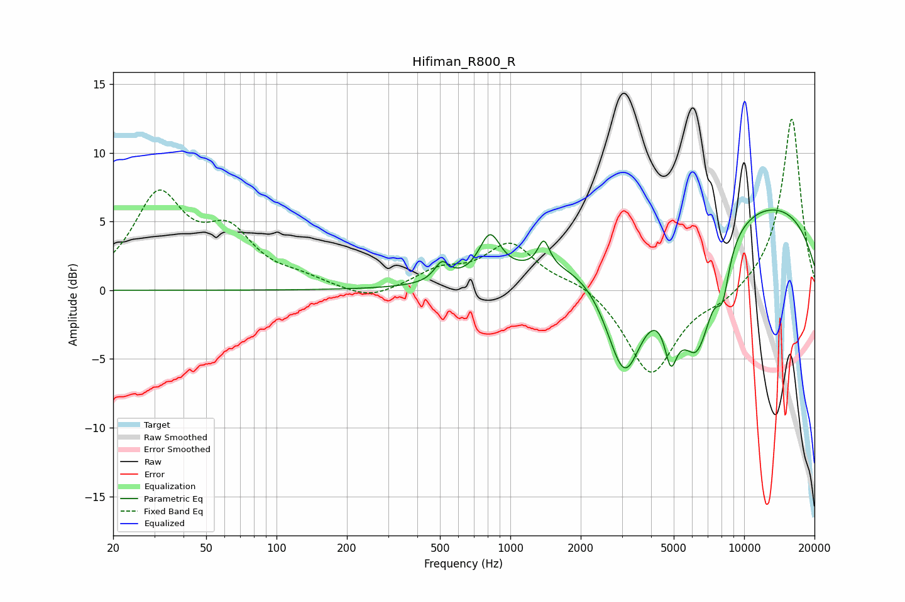

# Hifiman_R800_R
See [usage instructions](https://github.com/jaakkopasanen/AutoEq#usage) for more options and info.

### Parametric EQs
Apply preamp of -5.9 dB when using parametric equalizer.

|   # | Type    |   Fc (Hz) |    Q |   Gain (dB) |
|-----|---------|-----------|------|-------------|
|   1 | Peaking |       509 | 4.59 |         1.3 |
|   2 | Peaking |       818 | 3.16 |         3   |
|   3 | Peaking |      1390 | 5.76 |         1.9 |
|   4 | Peaking |      3079 | 1.6  |        -9.5 |
|   5 | Peaking |      4855 | 5.4  |        -3.3 |
|   6 | Peaking |      5768 | 1.34 |        -7   |
|   7 | Peaking |      6210 | 4.11 |        -1.3 |
|   8 | Peaking |      6740 | 3.04 |        -2.1 |
|   9 | Peaking |      8092 | 4.54 |        -3.2 |
|  10 | Peaking |      8477 | 0.18 |         7.1 |

### Fixed Band EQs
When using fixed band (also called graphic) equalizer, apply preamp of **-12.6 dB** (if available) and set gains manually with these parameters.

|   # | Type    |   Fc (Hz) |    Q |   Gain (dB) |
|-----|---------|-----------|------|-------------|
|   1 | Peaking |        31 | 1.41 |         6.6 |
|   2 | Peaking |        62 | 1.41 |         3.6 |
|   3 | Peaking |       125 | 1.41 |         0.6 |
|   4 | Peaking |       250 | 1.41 |        -0.8 |
|   5 | Peaking |       500 | 1.41 |         1.3 |
|   6 | Peaking |      1000 | 1.41 |         3.3 |
|   7 | Peaking |      2000 | 1.41 |         0.7 |
|   8 | Peaking |      4000 | 1.41 |        -6.2 |
|   9 | Peaking |      8000 | 1.41 |        -0.8 |
|  10 | Peaking |     16000 | 1.41 |        12.6 |

### Graphs

