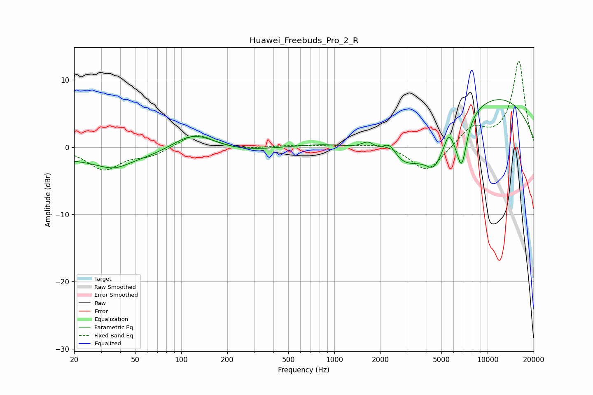

# Huawei_Freebuds_Pro_2_R
See [usage instructions](https://github.com/jaakkopasanen/AutoEq#usage) for more options and info.

### Parametric EQs
Apply preamp of -7.2 dB when using parametric equalizer.

|   # | Type    |   Fc (Hz) |    Q |   Gain (dB) |
|-----|---------|-----------|------|-------------|
|   1 | Peaking |        36 | 1.47 |        -1.3 |
|   2 | Peaking |        55 | 0.18 |        -2.3 |
|   3 | Peaking |       120 | 0.91 |         3.7 |
|   4 | Peaking |      1663 | 3.08 |         1.4 |
|   5 | Peaking |      2280 | 2.97 |         2.6 |
|   6 | Peaking |      2851 | 0.53 |       -11.5 |
|   7 | Peaking |      4500 | 2.33 |        -4   |
|   8 | Peaking |      5566 | 6    |         1.6 |
|   9 | Peaking |      6027 | 0.18 |        10.3 |
|  10 | Peaking |      6767 | 3.79 |        -7.1 |

### Fixed Band EQs
When using fixed band (also called graphic) equalizer, apply preamp of **-12.9 dB** (if available) and set gains manually with these parameters.

|   # | Type    |   Fc (Hz) |    Q |   Gain (dB) |
|-----|---------|-----------|------|-------------|
|   1 | Peaking |        31 | 1.41 |        -3.3 |
|   2 | Peaking |        62 | 1.41 |        -1.2 |
|   3 | Peaking |       125 | 1.41 |         2.1 |
|   4 | Peaking |       250 | 1.41 |        -0.4 |
|   5 | Peaking |       500 | 1.41 |         0.2 |
|   6 | Peaking |      1000 | 1.41 |         0.3 |
|   7 | Peaking |      2000 | 1.41 |         0.7 |
|   8 | Peaking |      4000 | 1.41 |        -3.9 |
|   9 | Peaking |      8000 | 1.41 |         2.8 |
|  10 | Peaking |     16000 | 1.41 |        12.8 |

### Graphs

