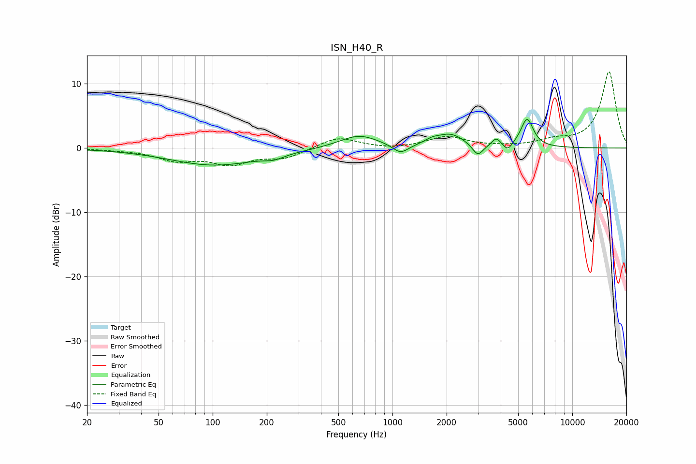

# ISN_H40_R
See [usage instructions](https://github.com/jaakkopasanen/AutoEq#usage) for more options and info.

### Parametric EQs
Apply preamp of -4.5 dB when using parametric equalizer.

|   # | Type    |   Fc (Hz) |    Q |   Gain (dB) |
|-----|---------|-----------|------|-------------|
|   1 | Peaking |       102 | 0.57 |        -2.6 |
|   2 | Peaking |       219 | 2.49 |        -0.7 |
|   3 | Peaking |       650 | 1.29 |         2.1 |
|   4 | Peaking |      1109 | 3.19 |        -1.5 |
|   5 | Peaking |      1656 | 3.43 |         0.6 |
|   6 | Peaking |      2102 | 1.83 |         2   |
|   7 | Peaking |      2980 | 4.72 |        -1.9 |
|   8 | Peaking |      3775 | 5.99 |         1.3 |
|   9 | Peaking |      4381 | 6    |        -1.2 |
|  10 | Peaking |      5603 | 4.04 |         4.4 |

### Fixed Band EQs
When using fixed band (also called graphic) equalizer, apply preamp of **-12.0 dB** (if available) and set gains manually with these parameters.

|   # | Type    |   Fc (Hz) |    Q |   Gain (dB) |
|-----|---------|-----------|------|-------------|
|   1 | Peaking |        31 | 1.41 |        -0.2 |
|   2 | Peaking |        62 | 1.41 |        -1.7 |
|   3 | Peaking |       125 | 1.41 |        -2.3 |
|   4 | Peaking |       250 | 1.41 |        -1.4 |
|   5 | Peaking |       500 | 1.41 |         1.8 |
|   6 | Peaking |      1000 | 1.41 |        -0.3 |
|   7 | Peaking |      2000 | 1.41 |         1.7 |
|   8 | Peaking |      4000 | 1.41 |         0.1 |
|   9 | Peaking |      8000 | 1.41 |         1   |
|  10 | Peaking |     16000 | 1.41 |        11.9 |

### Graphs

