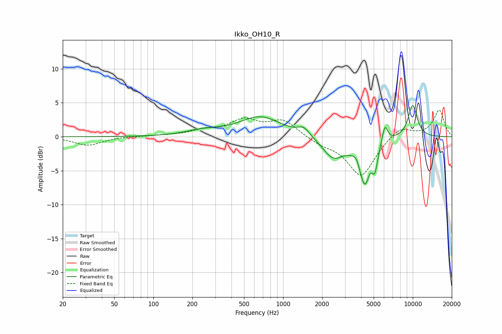

# Ikko_OH10_R
See [usage instructions](https://github.com/jaakkopasanen/AutoEq#usage) for more options and info.

### Parametric EQs
Apply preamp of -4.7 dB when using parametric equalizer.

|   # | Type    |   Fc (Hz) |    Q |   Gain (dB) |
|-----|---------|-----------|------|-------------|
|   1 | Peaking |       240 | 1.09 |         0.7 |
|   2 | Peaking |       669 | 0.87 |         2.9 |
|   3 | Peaking |      1445 | 3.14 |         1.2 |
|   4 | Peaking |      2439 | 1.71 |        -3   |
|   5 | Peaking |      3698 | 5.19 |         1.1 |
|   6 | Peaking |      4287 | 2.87 |        -7.1 |
|   7 | Peaking |      4670 | 5.99 |         1.2 |
|   8 | Peaking |      5096 | 5.99 |        -2.9 |
|   9 | Peaking |      6093 | 6    |         2.8 |
|  10 | Peaking |     10000 | 3.38 |         4.8 |

### Fixed Band EQs
When using fixed band (also called graphic) equalizer, apply preamp of **-4.0 dB** (if available) and set gains manually with these parameters.

|   # | Type    |   Fc (Hz) |    Q |   Gain (dB) |
|-----|---------|-----------|------|-------------|
|   1 | Peaking |        31 | 1.41 |        -1.3 |
|   2 | Peaking |        62 | 1.41 |         0.1 |
|   3 | Peaking |       125 | 1.41 |         0.2 |
|   4 | Peaking |       250 | 1.41 |         0.8 |
|   5 | Peaking |       500 | 1.41 |         2.3 |
|   6 | Peaking |      1000 | 1.41 |         2.3 |
|   7 | Peaking |      2000 | 1.41 |        -0.9 |
|   8 | Peaking |      4000 | 1.41 |        -5.8 |
|   9 | Peaking |      8000 | 1.41 |         1.6 |
|  10 | Peaking |     16000 | 1.41 |         3.9 |

### Graphs

