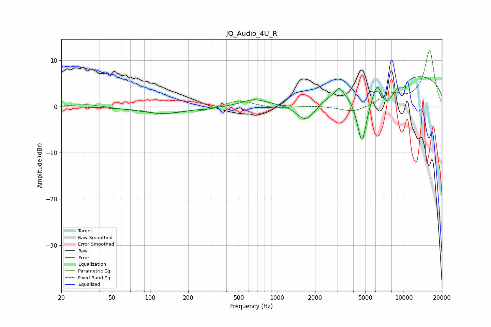

# JQ_Audio_4U_R
See [usage instructions](https://github.com/jaakkopasanen/AutoEq#usage) for more options and info.

### Parametric EQs
Apply preamp of -6.6 dB when using parametric equalizer.

|   # | Type    |   Fc (Hz) |    Q |   Gain (dB) |
|-----|---------|-----------|------|-------------|
|   1 | Peaking |       128 | 0.8  |        -1.5 |
|   2 | Peaking |       292 | 2.72 |        -0.2 |
|   3 | Peaking |       659 | 1.61 |         1.3 |
|   4 | Peaking |      1705 | 1.66 |        -5.2 |
|   5 | Peaking |      3107 | 5.31 |         1.8 |
|   6 | Peaking |      4684 | 3.19 |       -12.7 |
|   7 | Peaking |      6190 | 4.41 |         3.3 |
|   8 | Peaking |      7351 | 2.18 |        -5   |
|   9 | Peaking |      9833 | 0.19 |         7.2 |
|  10 | Peaking |      9952 | 4.16 |        -1.5 |

### Fixed Band EQs
When using fixed band (also called graphic) equalizer, apply preamp of **-12.2 dB** (if available) and set gains manually with these parameters.

|   # | Type    |   Fc (Hz) |    Q |   Gain (dB) |
|-----|---------|-----------|------|-------------|
|   1 | Peaking |        31 | 1.41 |         0.5 |
|   2 | Peaking |        62 | 1.41 |        -0.4 |
|   3 | Peaking |       125 | 1.41 |        -1.5 |
|   4 | Peaking |       250 | 1.41 |        -0.8 |
|   5 | Peaking |       500 | 1.41 |         1.4 |
|   6 | Peaking |      1000 | 1.41 |        -0.4 |
|   7 | Peaking |      2000 | 1.41 |         0.2 |
|   8 | Peaking |      4000 | 1.41 |        -1.4 |
|   9 | Peaking |      8000 | 1.41 |         2.5 |
|  10 | Peaking |     16000 | 1.41 |        12.1 |

### Graphs

