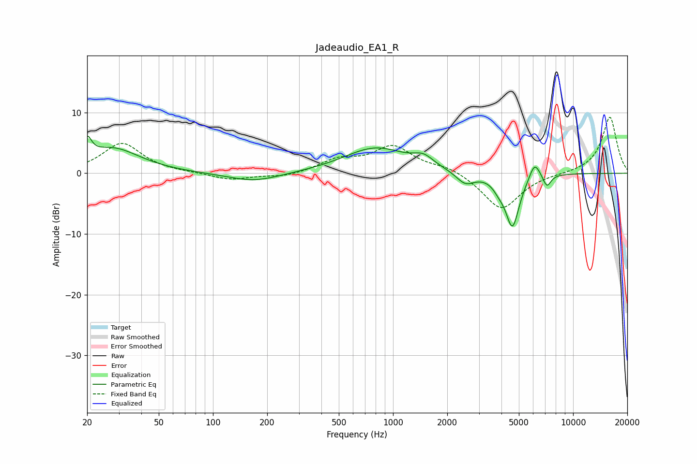

# Jadeaudio_EA1_R
See [usage instructions](https://github.com/jaakkopasanen/AutoEq#usage) for more options and info.

### Parametric EQs
Apply preamp of -6.2 dB when using parametric equalizer.

|   # | Type    |   Fc (Hz) |    Q |   Gain (dB) |
|-----|---------|-----------|------|-------------|
|   1 | Peaking |        20 | 5.98 |         3.2 |
|   2 | Peaking |        28 | 0.93 |         4.1 |
|   3 | Peaking |       169 | 0.96 |        -1.5 |
|   4 | Peaking |       799 | 0.81 |         4.2 |
|   5 | Peaking |      1476 | 2.55 |         1.6 |
|   6 | Peaking |      2520 | 2.74 |        -2   |
|   7 | Peaking |      3863 | 4.42 |        -1.1 |
|   8 | Peaking |      4603 | 3.56 |        -8.7 |
|   9 | Peaking |      6115 | 4.55 |         2.9 |
|  10 | Peaking |      7153 | 6    |        -2.1 |

### Fixed Band EQs
When using fixed band (also called graphic) equalizer, apply preamp of **-9.3 dB** (if available) and set gains manually with these parameters.

|   # | Type    |   Fc (Hz) |    Q |   Gain (dB) |
|-----|---------|-----------|------|-------------|
|   1 | Peaking |        31 | 1.41 |         4.9 |
|   2 | Peaking |        62 | 1.41 |         0.1 |
|   3 | Peaking |       125 | 1.41 |        -1.1 |
|   4 | Peaking |       250 | 1.41 |        -0.6 |
|   5 | Peaking |       500 | 1.41 |         2   |
|   6 | Peaking |      1000 | 1.41 |         4.2 |
|   7 | Peaking |      2000 | 1.41 |         1.1 |
|   8 | Peaking |      4000 | 1.41 |        -6.1 |
|   9 | Peaking |      8000 | 1.41 |        -0   |
|  10 | Peaking |     16000 | 1.41 |         9.3 |

### Graphs

