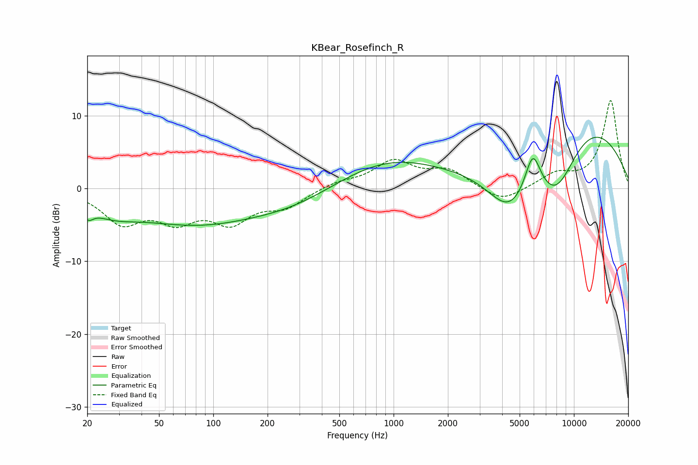

# KBear_Rosefinch_R
See [usage instructions](https://github.com/jaakkopasanen/AutoEq#usage) for more options and info.

### Parametric EQs
Apply preamp of -7.1 dB when using parametric equalizer.

|   # | Type    |   Fc (Hz) |    Q |   Gain (dB) |
|-----|---------|-----------|------|-------------|
|   1 | Peaking |        20 | 4.84 |        -1.5 |
|   2 | Peaking |        21 | 2.07 |         0.4 |
|   3 | Peaking |        26 | 0.93 |        -2.3 |
|   4 | Peaking |        80 | 0.41 |        -4.4 |
|   5 | Peaking |       289 | 0.56 |        -2   |
|   6 | Peaking |       923 | 0.48 |         4   |
|   7 | Peaking |      4404 | 1.07 |        -6.9 |
|   8 | Peaking |      5914 | 3.13 |         5.7 |
|   9 | Peaking |      8025 | 0.94 |        -9.7 |
|  10 | Peaking |     10000 | 0.37 |        11.9 |

### Fixed Band EQs
When using fixed band (also called graphic) equalizer, apply preamp of **-12.2 dB** (if available) and set gains manually with these parameters.

|   # | Type    |   Fc (Hz) |    Q |   Gain (dB) |
|-----|---------|-----------|------|-------------|
|   1 | Peaking |        31 | 1.41 |        -4.4 |
|   2 | Peaking |        62 | 1.41 |        -3.7 |
|   3 | Peaking |       125 | 1.41 |        -4.1 |
|   4 | Peaking |       250 | 1.41 |        -2.3 |
|   5 | Peaking |       500 | 1.41 |         0.9 |
|   6 | Peaking |      1000 | 1.41 |         3.6 |
|   7 | Peaking |      2000 | 1.41 |         2.4 |
|   8 | Peaking |      4000 | 1.41 |        -2   |
|   9 | Peaking |      8000 | 1.41 |         1.8 |
|  10 | Peaking |     16000 | 1.41 |        12.1 |

### Graphs

