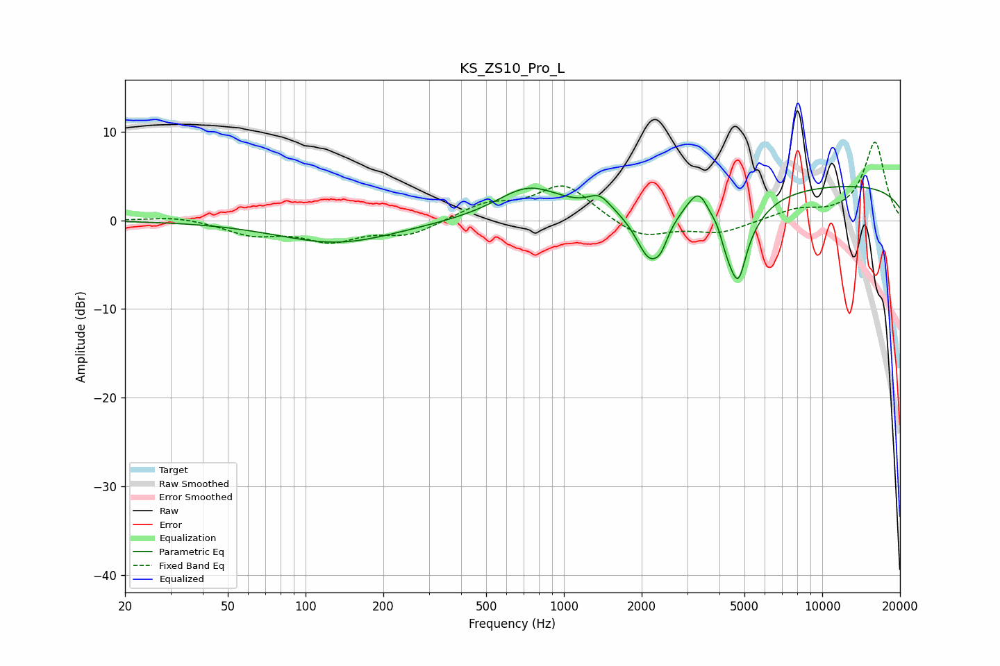

# KS_ZS10_Pro_L
See [usage instructions](https://github.com/jaakkopasanen/AutoEq#usage) for more options and info.

### Parametric EQs
Apply preamp of -3.9 dB when using parametric equalizer.

|   # | Type    |   Fc (Hz) |    Q |   Gain (dB) |
|-----|---------|-----------|------|-------------|
|   1 | Peaking |       133 | 0.62 |        -2.6 |
|   2 | Peaking |       729 | 1.13 |         3.5 |
|   3 | Peaking |      1373 | 3.29 |         1.6 |
|   4 | Peaking |      2142 | 2.64 |        -5.7 |
|   5 | Peaking |      2378 | 5.41 |        -1.6 |
|   6 | Peaking |      3343 | 3.14 |         3.8 |
|   7 | Peaking |      3933 | 5.84 |         1.4 |
|   8 | Peaking |      4448 | 1.94 |        -8   |
|   9 | Peaking |      4753 | 5.54 |        -3.3 |
|  10 | Peaking |     10000 | 0.18 |         4.1 |

### Fixed Band EQs
When using fixed band (also called graphic) equalizer, apply preamp of **-8.9 dB** (if available) and set gains manually with these parameters.

|   # | Type    |   Fc (Hz) |    Q |   Gain (dB) |
|-----|---------|-----------|------|-------------|
|   1 | Peaking |        31 | 1.41 |         0.5 |
|   2 | Peaking |        62 | 1.41 |        -1.5 |
|   3 | Peaking |       125 | 1.41 |        -2.1 |
|   4 | Peaking |       250 | 1.41 |        -1.6 |
|   5 | Peaking |       500 | 1.41 |         1.7 |
|   6 | Peaking |      1000 | 1.41 |         4   |
|   7 | Peaking |      2000 | 1.41 |        -2.1 |
|   8 | Peaking |      4000 | 1.41 |        -1.4 |
|   9 | Peaking |      8000 | 1.41 |         1.1 |
|  10 | Peaking |     16000 | 1.41 |         8.8 |

### Graphs

