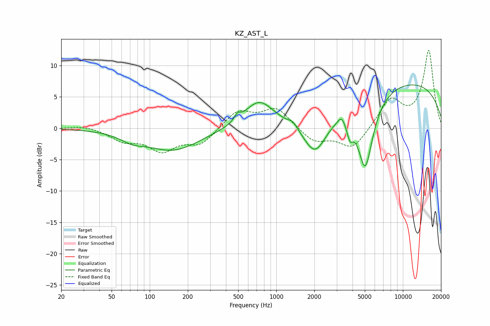

# KZ_AST_L
See [usage instructions](https://github.com/jaakkopasanen/AutoEq#usage) for more options and info.

### Parametric EQs
Apply preamp of -7.0 dB when using parametric equalizer.

|   # | Type    |   Fc (Hz) |    Q |   Gain (dB) |
|-----|---------|-----------|------|-------------|
|   1 | Peaking |        73 | 1.47 |        -1.1 |
|   2 | Peaking |       153 | 0.67 |        -3.5 |
|   3 | Peaking |       492 | 5.98 |         1   |
|   4 | Peaking |       729 | 1.24 |         4.3 |
|   5 | Peaking |      1352 | 4.1  |         0.8 |
|   6 | Peaking |      2022 | 1.47 |        -6.4 |
|   7 | Peaking |      3272 | 5.14 |         1.2 |
|   8 | Peaking |      3818 | 5.9  |        -2.5 |
|   9 | Peaking |      5046 | 2.2  |       -11.9 |
|  10 | Peaking |      9511 | 0.22 |         7.6 |

### Fixed Band EQs
When using fixed band (also called graphic) equalizer, apply preamp of **-12.5 dB** (if available) and set gains manually with these parameters.

|   # | Type    |   Fc (Hz) |    Q |   Gain (dB) |
|-----|---------|-----------|------|-------------|
|   1 | Peaking |        31 | 1.41 |         0.5 |
|   2 | Peaking |        62 | 1.41 |        -1.8 |
|   3 | Peaking |       125 | 1.41 |        -3.3 |
|   4 | Peaking |       250 | 1.41 |        -2.5 |
|   5 | Peaking |       500 | 1.41 |         2.8 |
|   6 | Peaking |      1000 | 1.41 |         3.2 |
|   7 | Peaking |      2000 | 1.41 |        -2.2 |
|   8 | Peaking |      4000 | 1.41 |        -3.3 |
|   9 | Peaking |      8000 | 1.41 |         4.5 |
|  10 | Peaking |     16000 | 1.41 |        12.3 |

### Graphs

