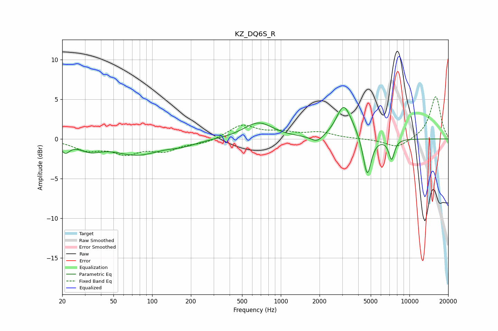

# KZ_DQ6S_R
See [usage instructions](https://github.com/jaakkopasanen/AutoEq#usage) for more options and info.

### Parametric EQs
Apply preamp of -4.1 dB when using parametric equalizer.

|   # | Type    |   Fc (Hz) |    Q |   Gain (dB) |
|-----|---------|-----------|------|-------------|
|   1 | Peaking |        21 | 4.24 |        -1.3 |
|   2 | Peaking |        33 | 1.66 |        -1.1 |
|   3 | Peaking |        76 | 0.82 |        -1.9 |
|   4 | Peaking |       173 | 1.3  |        -0.6 |
|   5 | Peaking |       669 | 1.25 |         2.1 |
|   6 | Peaking |      1914 | 3.02 |        -0.9 |
|   7 | Peaking |      3065 | 2.53 |         3.7 |
|   8 | Peaking |      3524 | 1.97 |         0.8 |
|   9 | Peaking |      4694 | 4.44 |        -5.1 |
|  10 | Peaking |      7262 | 6    |        -2.5 |

### Fixed Band EQs
When using fixed band (also called graphic) equalizer, apply preamp of **-5.4 dB** (if available) and set gains manually with these parameters.

|   # | Type    |   Fc (Hz) |    Q |   Gain (dB) |
|-----|---------|-----------|------|-------------|
|   1 | Peaking |        31 | 1.41 |        -1.3 |
|   2 | Peaking |        62 | 1.41 |        -1.6 |
|   3 | Peaking |       125 | 1.41 |        -1.3 |
|   4 | Peaking |       250 | 1.41 |        -0.5 |
|   5 | Peaking |       500 | 1.41 |         1.7 |
|   6 | Peaking |      1000 | 1.41 |         0.7 |
|   7 | Peaking |      2000 | 1.41 |         0.8 |
|   8 | Peaking |      4000 | 1.41 |         0   |
|   9 | Peaking |      8000 | 1.41 |        -1.2 |
|  10 | Peaking |     16000 | 1.41 |         5.4 |

### Graphs

