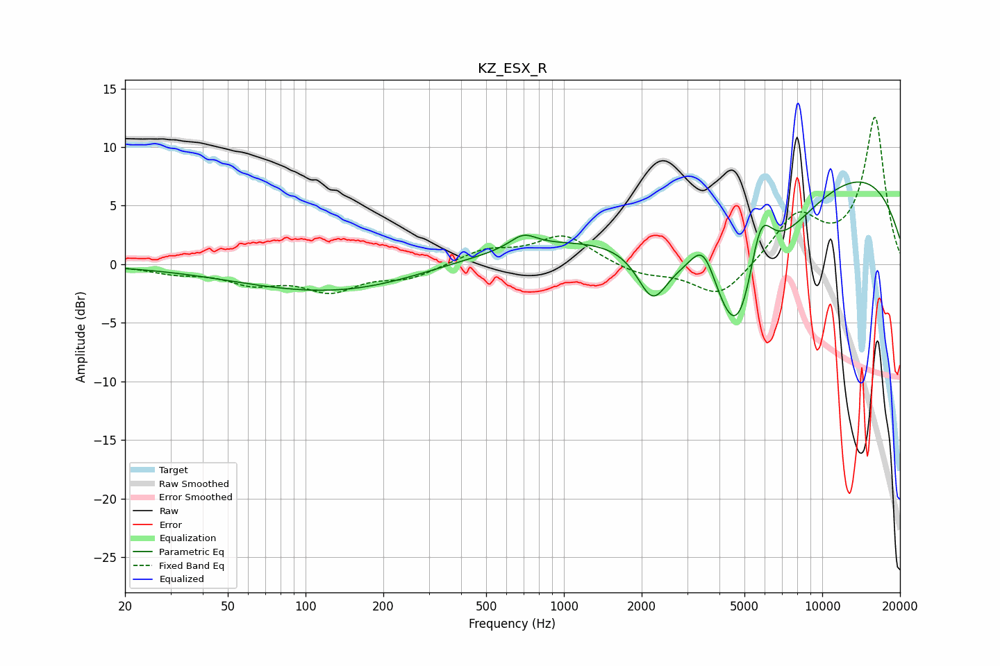

# KZ_ESX_R
See [usage instructions](https://github.com/jaakkopasanen/AutoEq#usage) for more options and info.

### Parametric EQs
Apply preamp of -7.1 dB when using parametric equalizer.

|   # | Type    |   Fc (Hz) |    Q |   Gain (dB) |
|-----|---------|-----------|------|-------------|
|   1 | Peaking |        72 | 0.68 |        -0.2 |
|   2 | Peaking |       179 | 0.45 |        -1.9 |
|   3 | Peaking |       242 | 0.18 |        -1.5 |
|   4 | Peaking |       696 | 2.72 |         1.2 |
|   5 | Peaking |       932 | 0.19 |         3.2 |
|   6 | Peaking |      2202 | 2.42 |        -4.1 |
|   7 | Peaking |      3478 | 2.59 |         4.1 |
|   8 | Peaking |      4789 | 0.86 |       -18.3 |
|   9 | Peaking |      5743 | 2.6  |         7.5 |
|  10 | Peaking |      9356 | 0.23 |        10.1 |

### Fixed Band EQs
When using fixed band (also called graphic) equalizer, apply preamp of **-12.6 dB** (if available) and set gains manually with these parameters.

|   # | Type    |   Fc (Hz) |    Q |   Gain (dB) |
|-----|---------|-----------|------|-------------|
|   1 | Peaking |        31 | 1.41 |        -0.6 |
|   2 | Peaking |        62 | 1.41 |        -1.4 |
|   3 | Peaking |       125 | 1.41 |        -2.1 |
|   4 | Peaking |       250 | 1.41 |        -1.1 |
|   5 | Peaking |       500 | 1.41 |         1.2 |
|   6 | Peaking |      1000 | 1.41 |         2.5 |
|   7 | Peaking |      2000 | 1.41 |        -0.9 |
|   8 | Peaking |      4000 | 1.41 |        -3   |
|   9 | Peaking |      8000 | 1.41 |         4   |
|  10 | Peaking |     16000 | 1.41 |        12.5 |

### Graphs

