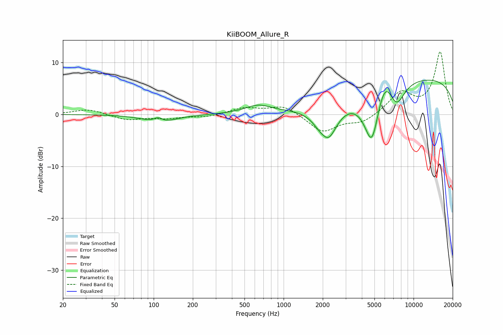

# KiiBOOM_Allure_R
See [usage instructions](https://github.com/jaakkopasanen/AutoEq#usage) for more options and info.

### Parametric EQs
Apply preamp of -6.7 dB when using parametric equalizer.

|   # | Type    |   Fc (Hz) |    Q |   Gain (dB) |
|-----|---------|-----------|------|-------------|
|   1 | Peaking |       108 | 4.29 |         1   |
|   2 | Peaking |       111 | 1.24 |        -1.7 |
|   3 | Peaking |       637 | 1.43 |         1.5 |
|   4 | Peaking |      1892 | 2.86 |        -0.8 |
|   5 | Peaking |      2172 | 1.38 |        -4.8 |
|   6 | Peaking |      2235 | 2.98 |        -2.2 |
|   7 | Peaking |      4780 | 2.18 |       -11.7 |
|   8 | Peaking |      5993 | 1.98 |         5.5 |
|   9 | Peaking |      7368 | 2.16 |        -5   |
|  10 | Peaking |     10000 | 0.18 |         7.2 |

### Fixed Band EQs
When using fixed band (also called graphic) equalizer, apply preamp of **-12.1 dB** (if available) and set gains manually with these parameters.

|   # | Type    |   Fc (Hz) |    Q |   Gain (dB) |
|-----|---------|-----------|------|-------------|
|   1 | Peaking |        31 | 1.41 |         1   |
|   2 | Peaking |        62 | 1.41 |        -1   |
|   3 | Peaking |       125 | 1.41 |        -0.7 |
|   4 | Peaking |       250 | 1.41 |        -0.5 |
|   5 | Peaking |       500 | 1.41 |         1.2 |
|   6 | Peaking |      1000 | 1.41 |         1.8 |
|   7 | Peaking |      2000 | 1.41 |        -3.4 |
|   8 | Peaking |      4000 | 1.41 |        -1.6 |
|   9 | Peaking |      8000 | 1.41 |         4.1 |
|  10 | Peaking |     16000 | 1.41 |        12   |

### Graphs

