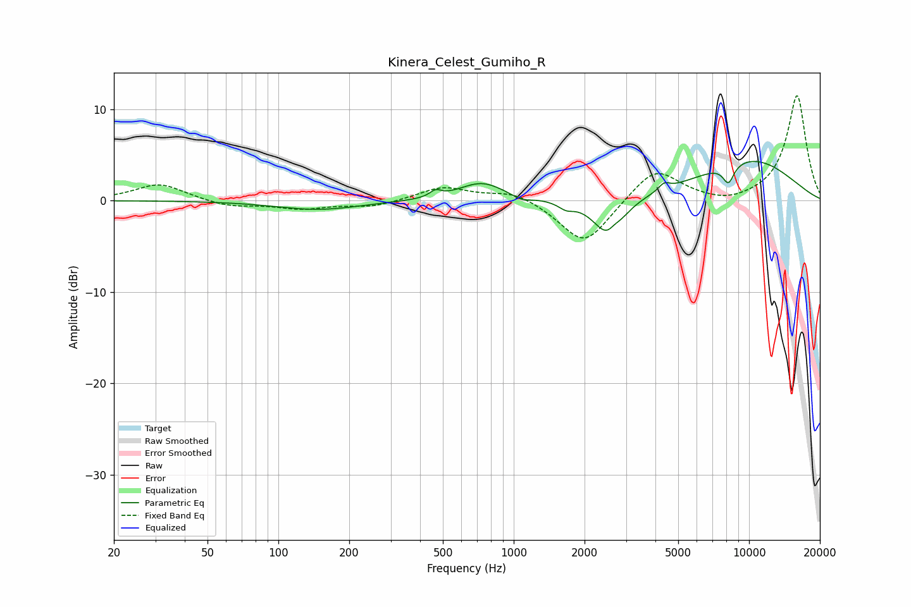

# Kinera_Celest_Gumiho_R
See [usage instructions](https://github.com/jaakkopasanen/AutoEq#usage) for more options and info.

### Parametric EQs
Apply preamp of -4.4 dB when using parametric equalizer.

|   # | Type    |   Fc (Hz) |    Q |   Gain (dB) |
|-----|---------|-----------|------|-------------|
|   1 | Peaking |       148 | 0.8  |        -1   |
|   2 | Peaking |       465 | 6    |         0.7 |
|   3 | Peaking |       731 | 1.45 |         2   |
|   4 | Peaking |      1076 | 3.61 |        -0.5 |
|   5 | Peaking |      1669 | 4.41 |        -0.7 |
|   6 | Peaking |      2533 | 2.24 |        -4.3 |
|   7 | Peaking |      2668 | 5.93 |         0.6 |
|   8 | Peaking |      4353 | 6    |         0.8 |
|   9 | Peaking |      8174 | 5.38 |        -2.1 |
|  10 | Peaking |     10000 | 0.55 |         4.5 |

### Fixed Band EQs
When using fixed band (also called graphic) equalizer, apply preamp of **-11.6 dB** (if available) and set gains manually with these parameters.

|   # | Type    |   Fc (Hz) |    Q |   Gain (dB) |
|-----|---------|-----------|------|-------------|
|   1 | Peaking |        31 | 1.41 |         1.9 |
|   2 | Peaking |        62 | 1.41 |        -0.7 |
|   3 | Peaking |       125 | 1.41 |        -0.8 |
|   4 | Peaking |       250 | 1.41 |        -0.7 |
|   5 | Peaking |       500 | 1.41 |         1.5 |
|   6 | Peaking |      1000 | 1.41 |         1.1 |
|   7 | Peaking |      2000 | 1.41 |        -5   |
|   8 | Peaking |      4000 | 1.41 |         3.7 |
|   9 | Peaking |      8000 | 1.41 |        -0.6 |
|  10 | Peaking |     16000 | 1.41 |        11.5 |

### Graphs

