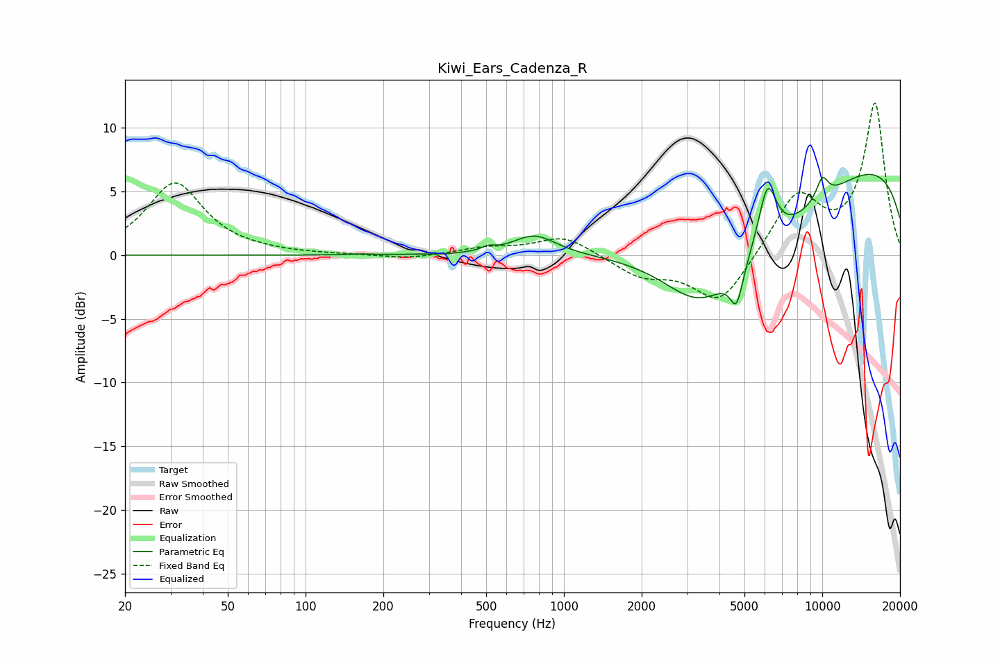

# Kiwi_Ears_Cadenza_R
See [usage instructions](https://github.com/jaakkopasanen/AutoEq#usage) for more options and info.

### Parametric EQs
Apply preamp of -6.4 dB when using parametric equalizer.

|   # | Type    |   Fc (Hz) |    Q |   Gain (dB) |
|-----|---------|-----------|------|-------------|
|   1 | Peaking |       161 | 3.94 |         0.1 |
|   2 | Peaking |       353 | 4.66 |        -0.1 |
|   3 | Peaking |       509 | 5.99 |         0.3 |
|   4 | Peaking |       769 | 1.73 |         1.5 |
|   5 | Peaking |      3335 | 1.06 |        -3.4 |
|   6 | Peaking |      4661 | 5.65 |        -2.9 |
|   7 | Peaking |      4853 | 0.41 |        -7   |
|   8 | Peaking |      6136 | 3.77 |         5   |
|   9 | Peaking |      9945 | 0.18 |         8.7 |
|  10 | Peaking |     10000 | 5.04 |         1.7 |

### Fixed Band EQs
When using fixed band (also called graphic) equalizer, apply preamp of **-12.0 dB** (if available) and set gains manually with these parameters.

|   # | Type    |   Fc (Hz) |    Q |   Gain (dB) |
|-----|---------|-----------|------|-------------|
|   1 | Peaking |        31 | 1.41 |         5.6 |
|   2 | Peaking |        62 | 1.41 |         0.1 |
|   3 | Peaking |       125 | 1.41 |         0   |
|   4 | Peaking |       250 | 1.41 |        -0.3 |
|   5 | Peaking |       500 | 1.41 |         0.5 |
|   6 | Peaking |      1000 | 1.41 |         1.5 |
|   7 | Peaking |      2000 | 1.41 |        -1.6 |
|   8 | Peaking |      4000 | 1.41 |        -3.9 |
|   9 | Peaking |      8000 | 1.41 |         4.7 |
|  10 | Peaking |     16000 | 1.41 |        11.8 |

### Graphs

