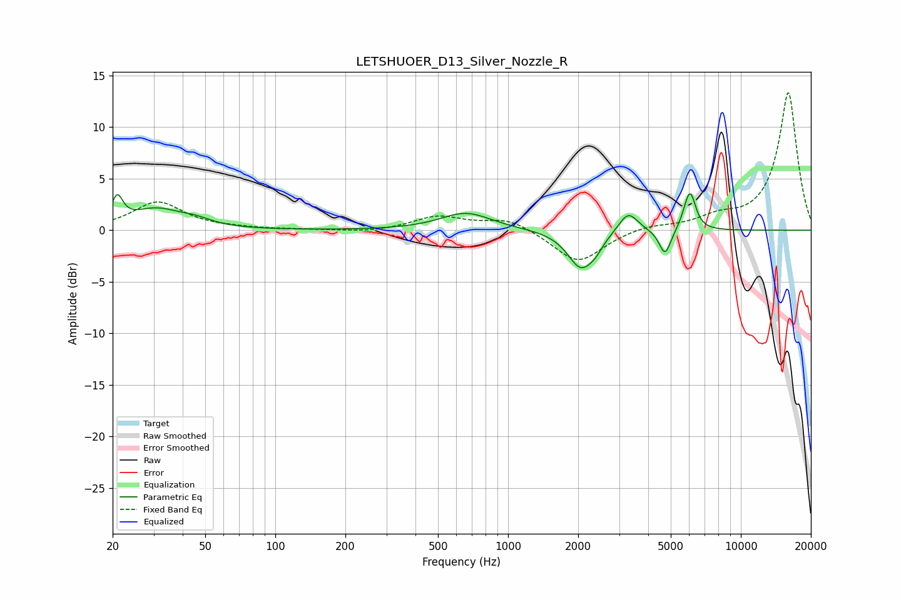

# LETSHUOER_D13_Silver_Nozzle_R
See [usage instructions](https://github.com/jaakkopasanen/AutoEq#usage) for more options and info.

### Parametric EQs
Apply preamp of -3.6 dB when using parametric equalizer.

|   # | Type    |   Fc (Hz) |    Q |   Gain (dB) |
|-----|---------|-----------|------|-------------|
|   1 | Peaking |        21 | 5.98 |         2.5 |
|   2 | Peaking |        31 | 1.3  |         1.9 |
|   3 | Peaking |        46 | 2.06 |         0.5 |
|   4 | Peaking |       659 | 1.3  |         1.7 |
|   5 | Peaking |      2060 | 2.47 |        -3.7 |
|   6 | Peaking |      2378 | 4.86 |        -0.6 |
|   7 | Peaking |      3281 | 3.39 |         2   |
|   8 | Peaking |      4727 | 5.51 |        -2.5 |
|   9 | Peaking |      5820 | 6    |         0.8 |
|  10 | Peaking |      6080 | 5.92 |         3.2 |

### Fixed Band EQs
When using fixed band (also called graphic) equalizer, apply preamp of **-13.4 dB** (if available) and set gains manually with these parameters.

|   # | Type    |   Fc (Hz) |    Q |   Gain (dB) |
|-----|---------|-----------|------|-------------|
|   1 | Peaking |        31 | 1.41 |         2.7 |
|   2 | Peaking |        62 | 1.41 |         0.1 |
|   3 | Peaking |       125 | 1.41 |         0   |
|   4 | Peaking |       250 | 1.41 |        -0.2 |
|   5 | Peaking |       500 | 1.41 |         1.3 |
|   6 | Peaking |      1000 | 1.41 |         1.2 |
|   7 | Peaking |      2000 | 1.41 |        -3.2 |
|   8 | Peaking |      4000 | 1.41 |         0.5 |
|   9 | Peaking |      8000 | 1.41 |         1   |
|  10 | Peaking |     16000 | 1.41 |        13.4 |

### Graphs

