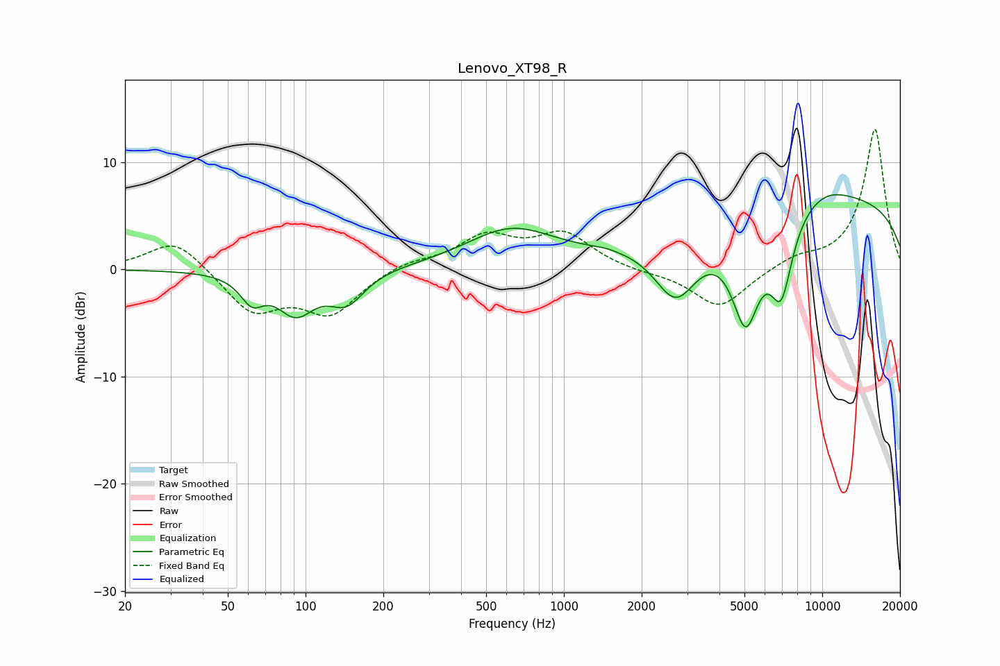

# Lenovo_XT98_R
See [usage instructions](https://github.com/jaakkopasanen/AutoEq#usage) for more options and info.

### Parametric EQs
Apply preamp of -7.0 dB when using parametric equalizer.

|   # | Type    |   Fc (Hz) |    Q |   Gain (dB) |
|-----|---------|-----------|------|-------------|
|   1 | Peaking |        62 | 3.16 |        -2.3 |
|   2 | Peaking |        92 | 1.95 |        -3.7 |
|   3 | Peaking |       144 | 2.05 |        -2.9 |
|   4 | Peaking |       620 | 0.83 |         3.5 |
|   5 | Peaking |      1448 | 4.3  |         0.1 |
|   6 | Peaking |      2715 | 1.61 |        -6.2 |
|   7 | Peaking |      5057 | 2.42 |        -9.4 |
|   8 | Peaking |      6939 | 2.99 |        -7.2 |
|   9 | Peaking |      9772 | 0.19 |         6.8 |
|  10 | Peaking |     10000 | 1.09 |         1.2 |

### Fixed Band EQs
When using fixed band (also called graphic) equalizer, apply preamp of **-13.1 dB** (if available) and set gains manually with these parameters.

|   # | Type    |   Fc (Hz) |    Q |   Gain (dB) |
|-----|---------|-----------|------|-------------|
|   1 | Peaking |        31 | 1.41 |         3   |
|   2 | Peaking |        62 | 1.41 |        -3.9 |
|   3 | Peaking |       125 | 1.41 |        -4   |
|   4 | Peaking |       250 | 1.41 |         0.8 |
|   5 | Peaking |       500 | 1.41 |         2.9 |
|   6 | Peaking |      1000 | 1.41 |         3.2 |
|   7 | Peaking |      2000 | 1.41 |        -0.3 |
|   8 | Peaking |      4000 | 1.41 |        -3.7 |
|   9 | Peaking |      8000 | 1.41 |         1   |
|  10 | Peaking |     16000 | 1.41 |        13.1 |

### Graphs

