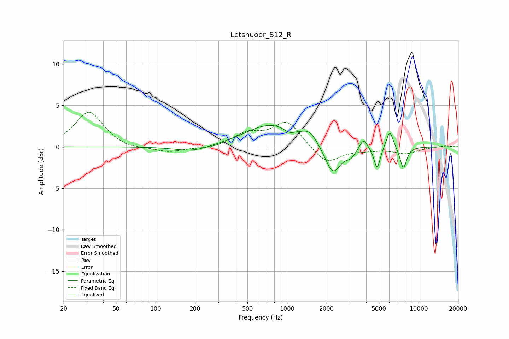

# Letshuoer_S12_R
See [usage instructions](https://github.com/jaakkopasanen/AutoEq#usage) for more options and info.

### Parametric EQs
Apply preamp of -2.7 dB when using parametric equalizer.

|   # | Type    |   Fc (Hz) |    Q |   Gain (dB) |
|-----|---------|-----------|------|-------------|
|   1 | Peaking |       192 | 1.08 |        -0.7 |
|   2 | Peaking |       760 | 0.73 |         2.7 |
|   3 | Peaking |      1039 | 3.45 |        -0.5 |
|   4 | Peaking |      1483 | 2.4  |         1.2 |
|   5 | Peaking |      2233 | 2.34 |        -3.6 |
|   6 | Peaking |      3061 | 3.83 |        -0.9 |
|   7 | Peaking |      3813 | 4.76 |         1.3 |
|   8 | Peaking |      4844 | 6    |        -2.7 |
|   9 | Peaking |      6048 | 5.26 |         2.2 |
|  10 | Peaking |      7666 | 5.15 |        -2.7 |

### Fixed Band EQs
When using fixed band (also called graphic) equalizer, apply preamp of **-4.3 dB** (if available) and set gains manually with these parameters.

|   # | Type    |   Fc (Hz) |    Q |   Gain (dB) |
|-----|---------|-----------|------|-------------|
|   1 | Peaking |        31 | 1.41 |         4.2 |
|   2 | Peaking |        62 | 1.41 |        -0.4 |
|   3 | Peaking |       125 | 1.41 |        -0.7 |
|   4 | Peaking |       250 | 1.41 |        -0.3 |
|   5 | Peaking |       500 | 1.41 |         1.5 |
|   6 | Peaking |      1000 | 1.41 |         3.1 |
|   7 | Peaking |      2000 | 1.41 |        -2.1 |
|   8 | Peaking |      4000 | 1.41 |        -0.3 |
|   9 | Peaking |      8000 | 1.41 |        -0.8 |
|  10 | Peaking |     16000 | 1.41 |         0.1 |

### Graphs

